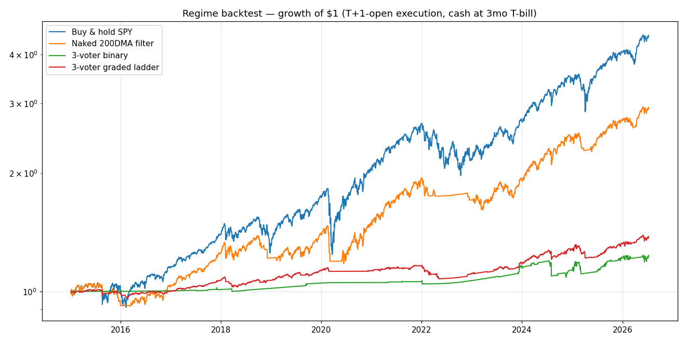
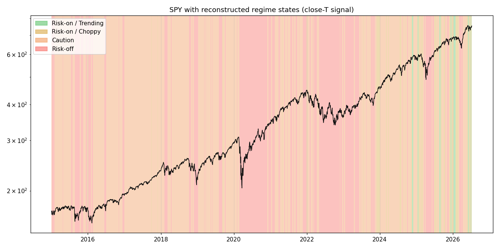
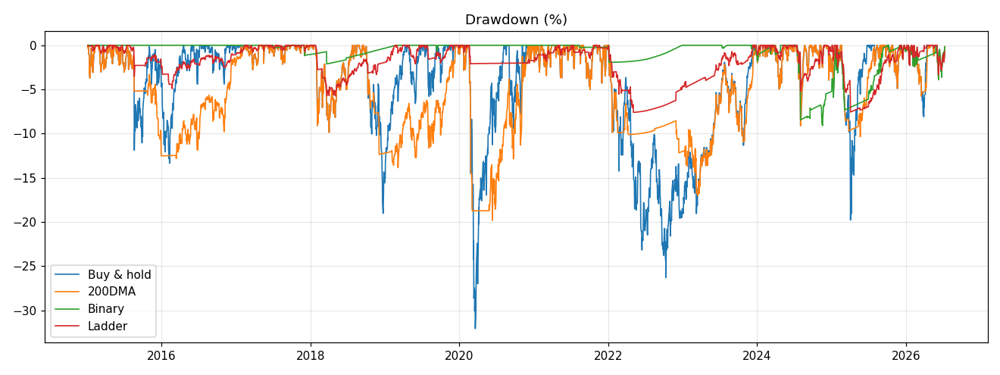

# Build 4 — Walk-Forward Regime Backtest (2015-01-02 → 2026-07-10)

The production 3-voter swing gauge (Build 1A: VIX 5d avg, HY OAS, RSP/SPY
breadth, with the SPY-vs-200DMA backdrop gate), reconstructed point-in-time
over 11.5 years and run through the **exact production decision code** —
`framework.regime_calculator.compute_regime`, extracted in step 0 so that
production delegates to it and the backtest imports it. No second copy of
the ladder exists.

**All three lookahead pins are green** (`test_regime_extraction.py`,
`test_backtest_regime.py`):

| Pin | What it proves | Result |
|---|---|---|
| 1. Production replay | 5 regime_history entries + 26 CI-committed framework.json artifacts + 78 recorded component votes replay through the extracted functions exactly | green |
| 2. Shift test | Lagging all inputs +1 day flips 9.8% of states, final equity ratio 1.136 — the signals are genuinely time-aligned, not accidentally contemporaneous | green |
| 3. Walk-window | 40 sampled dates rebuilt from data truncated at T are bit-identical to the full-series values — nothing reads past T | green |

One deliberate divergence from the pre-refactor inline code (review
finding, kept intentionally): non-finite gauge values used to fall
through the `<=` comparisons to a **risk_off** vote — with two NaN
voters the old code could print Risk-off on a pure data outage, against
the ladder's own documented contract. The extracted voters (and now the
production gauges, which carry explicit guards) vote **unavailable**
instead; 2+ unavailable resolves to Caution. Pinned in
`test_regime_extraction.py`. On finite inputs — every recorded artifact —
behavior is bit-identical.

---

## Executive summary — the honest version

1. **The production config, run as-is, would have kept you out of the
   market for nine of the last eleven years.** Time invested 8.9%
   (binary). CAGR 1.85% vs 13.93% buy-and-hold. The cause is structural:
   the HY voter's absolute OAS thresholds (risk-on ≤ 3.0%) were set in the
   2026 tight-spread era. OAS closed below 3.0% on ~zero days between 2015
   and 2023 — the HY voter cast **0% risk-on votes for nine straight
   years**, Trending (which needs 3/3) never printed, and the "0 risk-on →
   Risk-off" floor fired through ordinary bull markets. 2017 — the calmest
   bull year on record — spent 243 of 251 days in Caution.
2. **The 3-voter gauge does not beat the naked 200DMA filter.** The
   spec required this sentence if true, and it is true by a wide margin:
   200DMA filter 9.83% CAGR / 0.68 Sharpe / −19.8% max DD vs binary
   1.85% / −0.03 / −9.1%. The one-line rule stayed ~83% invested and
   still de-risked every major crash window.
3. **The graded ladder beats the binary** (2.83% CAGR / 0.22 Sharpe vs
   1.85% / −0.03) — required sentence, other direction: the ladder's 30%
   Caution sleeve kept some exposure through years the gauge mislabeled.
   Both remain far behind both benchmarks; this is damage limitation, not
   vindication.
4. **The information test inverts.** Forward SPY returns measured from
   T+1 open were *best* on Risk-off days (20d mean +1.90%, 70.7% hit
   rate). Trending edges Caution at 5 days (+0.27% vs +0.22%) but loses
   at 10 (+0.40% vs +0.43%) and 20 days (+0.42% vs +0.80%), and is
   dominated by Risk-off at every horizon.
   Per Decision 5: no strategy wrapper saves this — reported straight.
   Two honest readings: (a) the threshold-era problem above pushes nine
   bull years' steady gains into the Caution/Risk-off buckets; (b) at
   daily granularity, "risk-off" days cluster near local bottoms, so
   forward windows from them capture rebounds — a mean-reversion effect
   that any fear-triggered gauge will exhibit. Neither reading rescues
   Trending as an edge over this sample.
5. **The July 2026 deployment was not a regime error** (case study
   below): production printed 3/3 risk-on on the Jul 1/2 closes; 99 of
   105 grid calibrations were INVESTED (60 Trending, 39 Choppy), no
   calibration printed Risk-off, and the 6 that printed Caution are
   OAS ≤ 2.5 corner configs invested on at most 3.6% of ALL days over
   11.5 years. The direction (invested) was calibration-robust; the
   degree (Trending vs Choppy) was not — 39 reasonable neighbors read
   Choppy, which the ladder sizes at 60% and the theme rules treat as
   "A+ setups only". The losses were position-level.
6. **What the gauge is, on this evidence:** a post-2024 instrument
   calibrated to the current credit regime, plus a well-behaved crash
   brake (fully out through COVID; 99% out through the 2022 bear — two
   Choppy days). What it is not: an all-weather 2015-2026 allocation
   machine. If all-weather
   behavior is wanted, the HY voter needs a *relative* spread measure
   (percentile / regime-adaptive), which is a Gauge-B-style design
   question, not a threshold tweak — the grid shows threshold tweaks
   trained on 2015-2021 do not survive validation.







---

## Data

| Series | Source | Notes |
|---|---|---|
| SPY, RSP, ^VIX, ^IRX | yfinance daily, 2013-12-02 →, `auto_adjust=True` | matches production's fetcher basis (framework_runner uses auto_adjust=True); warmup covers the 200DMA by 2015-01 |
| HY OAS (BAMLH0A0HYM2) | FRED — **spliced**: pre-truncation Wayback capture (2025-11-04) of the full-history CSV + live FRED 3-year window | **FRED truncated this series to a rolling 3 years in April 2026** (ICE licensing; ALFRED vintages retroactively truncated too). The splice's 607-observation overlap matches byte-for-byte (max diff 0.0). Both segments are genuine FRED-published values; no proxy data |
| Cash | ^IRX (3-mo T-bill discount yield), daily accrual | applied to the uninvested fraction |

Raw pulls are cached in `data/backtest_cache/` (gitignored). To rebuild:
yfinance start=2013-12-02 for the four tickers; the OAS splice recipe is in
this section (Wayback snapshot `20251104204105` of
`fredgraph.csv?id=BAMLH0A0HYM2` + live `fredgraph.csv` for 2023-07→).

**Point-in-time discipline:** VIX 5d, breadth (production's exact
current-ratio-vs-20d-means formula), and SPY-vs-200DMA are trailing
windows ending at close T. OAS is lagged one trading day (FRED publishes
day X the following business morning — production's "latest available"
read sees the same), mapped to the trading calendar as-of (ICE's
month-end weekend observations carry forward instead of being dropped). Honesty note per spec: production CI has been running
the HYG/IEF **fallback** (no FRED key in Actions); this backtest runs the
**current config's primary** — OAS absolute thresholds 3.0/4.0 — which is
what the config declares and what Render runs.

## Execution model

Signals compute on close T; all fills at T+1 open; equity accrues
open-to-open (exposure during [open(t+1), open(t+2)) is the weight decided
at close t). Uninvested fraction earns the T-bill rate daily.

**EOD-lag cost** (Decision 1): the signed cost of the T+1-open fill vs the
hypothetical close-T fill:

| Strategy | Switches | Total lag cost | Per switch |
|---|---|---|---|
| binary | 73 | **+7.88%** (adverse) | 10.8 bp |
| ladder | 284 | +0.79% | 0.3 bp |

An exact re-simulation with close-T fills, endpoint-aligned to the same
final close, ends **8.3% higher** (binary; ratio 1.0827 — consistent to
first order with the 7.88% per-switch sum). Direction confirmed:
overnight gaps systematically move against a close-signaled regime
switch (you buy strength higher the next morning, sell weakness lower).
This number is what gates any future intraday-execution question; the
intraday *alerts* (PER-510-B) already ship separately and change nothing
here.

## Headline results

| | CAGR | Max DD | Sharpe | Sortino | Avg exposure | Days invested | Switches/yr | Whipsaws/yr |
|---|---|---|---|---|---|---|---|---|
| Buy & hold SPY | **13.93%** | −32.0% | **0.74** | 1.02 | 100% | 100% | 0 | 0 |
| Naked 200DMA | 9.83% | −19.8% | 0.68 | 0.95 | 82.6% | 82.6% | 5.4 | 3.3 |
| 3-voter binary | 1.85% | −9.1% | −0.03 | 0.16 | 8.9% | 8.9% | 6.4 | 3.8 |
| 3-voter ladder | 2.83% | −7.6% | 0.22 | 0.63 | 23.0% | 65.5% | 24.7 | 16.1 |

Whipsaw = a switch reversed within 10 trading days. The ladder's 16.1/yr
churn is the fractional-weight steps flickering with the vote count. Avg
exposure and days-invested are different facts (review-corrected): the
ladder holds *some* exposure on 65.5% of days but averages only 23%
because most of those days are the 30% Caution sleeve.

State days: Trending 51 · Choppy 207 · Caution 1,638 · Risk-off 1,000
(of 2,896).

## Drawdown table — did it get out?

| Window | SPY | Binary avg/min exposure | Ladder avg | 200DMA avg | States seen |
|---|---|---|---|---|---|
| 2015-16 correction | −5.7% | 0% / 0% | 11.0% | 44.3% | RO 106, Ca 61 |
| Q4 2018 | −14.0% | 0% / 0% | 13.3% | 41.4% | RO 39, Ca 31 |
| COVID 2020 | −23.4% | 0% / 0% | 4.0% | 26.7% | RO 26, Ca 4 |
| 2022 bear | −18.2% | 1.0% / 0% | 7.6% | 20.6% | RO 158, Ca 49 |
| 2025 tariff shock | −3.1% | 19.4% / 0% | 20.6% | 32.3% | mixed |
| 2026 semi unwind | +0.3% | 100% / 100% | 75.6% | 100% | T 7, C 11 |

The honest caveat: "it got out" is vacuous for 2015-2022 — the gauge was
essentially never *in*. The 200DMA column is the meaningful comparison: it
carried real exposure into each window and still de-risked. Only the
2025-26 windows show the 3-voter gauge making live in-market decisions —
which matches its post-2024 calibration era.

## Information test (Decision 5 — no strategy wrapper)

Forward SPY returns from T+1 open, by state at close T:

| State | Days | 5d mean / hit | 10d mean / hit | 20d mean / hit |
|---|---|---|---|---|
| Trending | 51 | +0.27% / 62.5% | +0.40% / 68.1% | +0.42% / 54.5% |
| Choppy | 207 | −0.14% / 53.9% | +0.06% / 51.0% | +0.28% / 64.8% |
| Caution | 1,638 | +0.22% / 62.1% | +0.43% / 65.9% | +0.80% / 69.7% |
| Risk-off | 1,000 | +0.47% / 62.4% | +0.90% / 64.9% | **+1.90% / 70.7%** |

Trending's forward returns do not beat Caution's (and are dominated by
Risk-off's) — reported straight, per the spec. See executive summary #4
for the two readings; note Trending's n=51 is thin because the state
barely existed before 2025.

**Flip anatomy / durations:** Trending — 17 runs, median 2 days, 11 of 17
runs ≤2 days (a flicker, not a regime). Choppy — 54 runs, median 2d.
Caution — 125 runs, median 5d, max 126d. Risk-off — 89 runs, median 4d,
max 194d. The top rung of the ladder, as configured, does not persist
long enough to hold a swing position against.

## Sensitivity grid — EXPERIMENTAL (Decision 4)

Trained 2015-2021, validated 2022-2026, binary strategy, 105 combos
(VIX risk-on 16-22 with +4 spacing; OAS risk-on 2.5-4.5 with +1.0 spacing;
breadth band ±0.25/±0.5/±0.75). Combos whose excess return is
identically zero in a window (never invested) would be excluded from
rankings as degenerate; with the as-of OAS alignment none met that bar,
though the OAS ≤ 2.5 corner comes close (invested on 1-4% of days).
**Production thresholds were not tuned on any of this; both windows are
always reported.**

| Combo (VIX/OAS/band) | Train Sharpe | Validate Sharpe |
|---|---|---|
| production 18/3.0/0.5 | 0.03 | −0.07 |
| best-train 22/4.5/0.25 | 1.14 | 0.15 |
| 22/4.0/0.25 | 1.11 | 0.12 |
| 21/4.5/0.25 | 1.09 | 0.08 |
| 21/4.0/0.25 | 1.05 | 0.08 |

Every top-train combo loosens VIX and OAS far enough to be invested in
2015-2021 — and then collapses out-of-sample (1.14 → 0.15). Read
plainly: within this family, **no fixed absolute-threshold calibration
generalizes across credit regimes.** That is evidence for a relative HY
measure (percentile basis), not for adopting 22/4.5/0.25.

## Case study — the July 2026 deployment

What did the config know on the closes that preceded the Jul 6 entries
(IWM/ARWR/BIIB) and the subsequent stop-outs?

| Close | VIX 5d | OAS | Breadth 20d | SPY vs 200DMA | State |
|---|---|---|---|---|---|
| Jul 1 | 17.60 | 2.75 | +0.98 | +8.4% | **Trending (3/3)** |
| Jul 2 | 17.05 | 2.74 | +1.61 | +8.1% | **Trending (3/3)** |
| Jul 6 | 16.48 | 2.75 | +0.63 | +9.0% | **Trending (3/3)** |

(There is no Jul 3 close — July 4th fell on a Saturday in 2026, so the
market observed the holiday on Friday Jul 3; Jul 2 was the last close
before the Monday Jul 6 entries.) The reconstruction independently prints
Trending on these closes, agreeing with what production actually recorded
— noting honestly that production was then still running the pre-1A
5-voter gauge, so this is agreement of conclusions across two gauge
structures (verified by the anchors test), not the exact-replay pin,
which covers Jul 5 onward. The naked 200DMA said invested.

The grid sweep, stated precisely (the first draft of this section
overclaimed and was corrected against the data):

| | Trending | Choppy (invested) | Caution/Risk-off (out) |
|---|---|---|---|
| Jul 1 close | 60/105 | 39 | 6 |
| Jul 2 close | 60/105 | 39 | 6 |
| Jul 6 close | 48/105 | 44 | 13 |

- **No calibration printed Risk-off on the pre-entry closes.** 99/105
  were invested under the binary interpretation.
- The 6 uninvested calibrations on Jul 1/2 are all OAS ≤ 2.5 corner
  configs — invested on at most 3.6% of ALL days over 11.5 years. They
  are permanently-defensive settings, not usable calibrations.
- The 39 Choppy dissenters include entirely reasonable neighbors
  (VIX ≤ 16-17 cutoffs missing the 17.05-17.60 5d average; several with
  looser OAS than production, up to 7.3% all-days Trending share — NOT
  degenerate). So the *degree* of risk-on was calibration-sensitive:
  under the graded ladder those settings would have sized July at 60%,
  and under the theme rules Choppy means "A+ setups only".
- Jul 6 (the entry-day close itself) shows weaker unanimity: 13
  calibrations out, including some non-trivial ones (16/4.5/0.75 is
  invested on 31.6% of all days).

**The honest answer: the direction was not a regime error — no usable
configuration read the July closes as risk-OFF, and production's
Trending call sits with the 60-combo majority. But the margin was
thinner than "Trending" suggests: a meaningful minority of defensible
calibrations read it as Choppy, the half-throttle state. The losses
were position-level (single-name biotech/semi exposure into an
earnings/sector unwind), not regime-level** — the index-level regime,
under any calibration, had nothing to catch them with; the stop
discipline (R11) was the layer that worked.

## Limitations

1. **Threshold provenance / mild in-sample bias:** the production VIX and
   OAS thresholds were chosen (July 2026) with awareness of recent data;
   2024-26 results flatter them. The pre-2024 period is the honest
   out-of-sample read, and it is unflattering.
2. **Regime history verification floor:** production regime records exist
   only from 2026-06-12, and only post-2026-07-05 entries are structurally
   comparable (the 1A 3-voter cutover). Pin 1 covers Jul 5 → now (31
   recorded runs); everything earlier is reconstruction, licensed by that
   pin plus pins 2/3.
3. **Primary-vs-fallback source history:** production CI has served the
   HYG/IEF percentile fallback (no FRED key in Actions); Render serves
   FRED primary. The backtest runs the primary. A fallback-basis replay
   would be a different (relative) gauge — related to the redesign
   direction in #6 of the summary, not implemented here.
4. **OAS availability:** FRED truncated BAMLH0A0HYM2 to 3 rolling years
   (April 2026). This backtest's pre-2023 OAS comes from a pre-truncation
   Wayback capture of FRED's own CSV (overlap verified byte-identical).
   Reproducing the cache from scratch now depends on that archive
   remaining available.
5. **Adjusted-price basis:** signals and returns use dividend-adjusted
   series, matching production's fetcher. Cash uses ^IRX with daily
   accrual. No transaction costs, taxes, or borrow — costs would further
   penalize the higher-churn ladder.
6. **Fear & Greed overlay variant: blocked on data.** No credible daily
   historical F&G series to 2015 exists from a reputable source (CNN does
   not publish an archive; third-party scrapes fail the spec's no-proxies
   fence). Skipped, per Decision 6.
7. **The 12:30-exit / intraday-execution question is Build 5's** — the
   EOD-lag number above (+7.88% cumulative, 10.8 bp/switch adverse) is
   this build's handoff to it.

## Reproduction

```
# pins
python3 test_regime_extraction.py
python3 test_backtest_regime.py        # needs local cache
# full run (writes docs/backtest-regime-results.json + docs/img/*.png)
python3 scripts/backtest_regime.py
```
