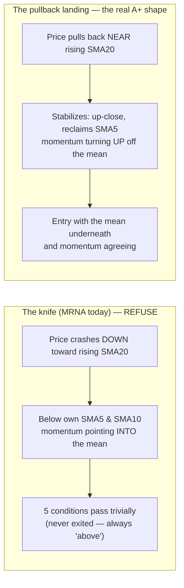

# A+ Doctrine — Design Brief (four questions)

**Session:** Sunday 2026-07-12 (deliberation 3 of 3) · **Trigger:** MRNA, this morning — five green pips, extension guard legitimately released at 0.43×ATR, and still obviously not a buy.
**The gap being closed:** "New entries only on A+ setups" (the Choppy regime action) has no definition. A+ lives in the trader's head. This brief codifies it — as a **computed setup grade** the engine emits, the panel renders, the Position Lab lets you twist, and Build 5 can backtest against your own trade history.

**The two live exhibits (the evidence):**

| | **ARWR — Jul 6 entry (the A+ you took)** | **MRNA — Jul 12 (the READY you must refuse)** |
|---|---|---|
| 5 conditions | ✅ all met | ✅ all met |
| Extension | 1.64×ATR — healthy trending distance | 0.43×ATR — *at* the mean |
| **Approach** | **Rising into entry** — close > SMA5 > SMA10, fresh breakout structure | **Falling knife** — close $68.27 *below* SMA5 ($76) and SMA10 ($74); −12% single-day arrival |
| RSI | ~60s — strong, not overbought | ~low-40s after the crash |
| Quality score | 86-89 (strong-buy band) | 55 (hold band), outranked |
| Group health | Biotech loaded with strong-buys | Biotech broken — stopped you out of everything 2 days ago |
| Earnings runway | 31 days | **19 calendar (~13 trading) days** |
| Outcome/verdict | The entry that survived the week | The chase the system must learn to name |

**The structural insight:** conditions 1–2 were designed to confirm a *reclaim after an exit*. A name that never exited and **falls down onto** its rising SMA20 passes them trivially — the engine cannot distinguish *landing softly on the mean* from *knifing through it*. The extension guard fixed the too-far-above case (item 20); this doctrine fixes the arriving-from-above case.

---

## Q1 — The approach filter: what mechanically separates landing from knife?

| Candidate | Rule at entry | Catches MRNA today? | Cost |
|---|---|---|---|
| **(a) SMA5 reclaim** | close > SMA5 | ✅ (68.27 < ~76) | May delay entry 1-3 days after a real low |
| (b) Short-slope pair | SMA5 ≥ SMA10 | ✅ | Slower still — needs days of repair |
| (c) Stabilization day | ≥1 up-close + higher low | ✅ | Weakest alone (one green day ≠ turn) |
| (d) Composite | (a) AND (c) | ✅ | Two signals agreeing — my pick |

**Recommendation: (d)** — `close > SMA5` **and** at least one up-close since the swing low. Simple, computable from data the engine already carries (sma5 ships since `f983fce`), and it encodes the trader's actual behavior: you never buy the red knife day; you buy the first evidence of the turn. Variants (b), longer stabilization windows → **Build 5 retest recipe.**

## Q2 — The full A+ checklist: what's REQUIRED?

Proposed required set — all must pass for the grade (stocks; index vehicles waive score/group rows):

1. The five mechanical conditions (existing)
2. Extension ≤ 1.8×ATR (existing guard)
3. **Approach filter** (Q1 ruling)
4. **RSI 45–70** at entry — below 45 is knife territory, above 70 is the chase the trade-signal ladder already penalizes
5. **Quality score ≥ 75** (strong-buy band) — your actual entries were 86/81/89; the universe's ≥50 gate is membership, not excellence
6. **Group breaker clear** (post-theme-retirement, this is the group-health check)
7. **Earnings runway** (Q3 ruling)

Everything else (volume ratio, 52wk-high distance, trade-signal string) stays **advisory** — displayed, not gating. **Recommendation: adopt the seven as written.** The grade computes as: all seven → **A+**; five conditions + guard but any of 3–7 failing → **B** (with named reasons); conditions failing → **C/blocked**.

## Q3 — Earnings runway: how much is enough?

R8's chip warns at ≤7 days — a *warning*, not an entry standard. A 2–6-week swing entered 10 days before earnings **straddles the catalyst by construction**. Options: ≥10 / **≥15** / ≥21 trading days. **Recommendation: ≥15 trading days (~3 weeks)** for A+ — the position gets a full swing's runway before the binary. Live consequence, stated honestly: **MRNA at ~13 trading days fails this bar today** — which matches the instinct the doctrine exists to encode. (Names inside the window aren't banned forever; they re-qualify after the print.)

## Q4 — Enforcement shape: advisory grade or hard gate?

| Regime | Recommendation |
|---|---|
| Choppy / Caution | **Hard gate** — RE_ENTRY_READY requires grade A+; otherwise state shows `READY (B — reasons…)` and the panel renders it as blocked-amber, same visual law as EXTENDED_HOLD |
| Trending | **Advisory** — grade displayed on every READY; B-grade entries permitted (the regime itself is the risk throttle, per D-008 Q4) |
| Always | Grade + failing reasons emitted in signals.json / assessment.json, rendered on the panel, **twistable in the Position Lab** (lab law 1: the grade computes server-side from the same function) |

**Recommendation: as tabled.** The doctrine hard-gates exactly where the regime demands excellence and informs everywhere else.

---

## Process rails

- Ships as **D-011** in the registry — with the two exhibits above as the evidence basis and this retest recipe: **Build 5 grades every historical entry** (yours + universe replay) and reports whether A+-graded entries outperform B/C on forward returns and stop-out rate. The doctrine is a hypothesis until the replay says otherwise; revisit trigger pre-written.
- Implementation is a **1B extension** (grade function beside `assess_position`), not a rewrite — lands after R28 (Phase 0), likely with Phase 1's condition-5 rewire.
- The grade function is pure and parameterized → the Position Lab exposes every threshold the day it ships.

## The four rulings requested

1. **Q1:** approach filter — (a) SMA5 reclaim, (b) slope pair, (c) stabilization day, or **(d) composite: SMA5 reclaim + up-close** ← recommended
2. **Q2:** the seven-item required checklist **as written** ← recommended (amend any row)
3. **Q3:** earnings runway — 10 / **15** / 21 trading days ← recommended
4. **Q4:** enforcement — **hard gate in Choppy/Caution, advisory in Trending, twistable in the Lab** ← recommended
