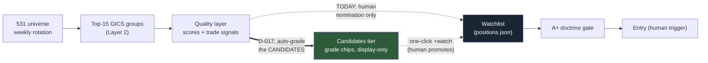

# Candidates Tier — Design Brief (four questions)

**Session:** Saturday 2026-07-18, late · **Trigger:** third bump into the tracked/un-tracked seam — HPQ at 84 BUY NOW with no grade because nobody nominated it
**The gap being closed:** `grade_setup` (D-011) only runs for names in positions.json. The funnel — universe → group → **[human nomination]** → watchlist → grade → entry — has a manual mouth. The scanner surfaces leaders; the doctrine grades watchers; nothing connects them automatically. Ships as **D-017**.

**The key technical fact that makes this cheap:** the grade is *stateless per run*. All seven rows — conditions, extension, approach, RSI, score, breaker, runway — compute from data the engine already has per ticker each close. Only the *state machine* (WATCHING → ARMING → READY, consecutive-close counters) is stateful and watchlist-only. So candidates can carry a **grade** without carrying a **state** — which also defines the honest display boundary.

---

## Q1 — Coverage: which names get auto-graded?

| Option | Set | Size |
|---|---|---|
| (a) Everything in signals.json | All tickers of all selected groups | ~42-54 names |
| (b) Top-N per leading group | e.g. top 2 by score, top-5 groups | ~10 |
| (c) Signal-filtered | Only BUY NOW / ACCUMULATE names | varies, ~10-20 |

**Recommendation: (a) — all signals.json names.** The set is already bounded by construction (the rotation's selected groups), the computation is trivial arithmetic on fields already computed, and partial coverage recreates the exact "why doesn't HPQ have a grade" question one tier down. Grade everything the page shows; let the *display* do the filtering.

## Q2 — What renders on an un-tracked candidate row?

**Recommendation: grade chip + failing reasons on hover — and nothing else.** No state badge (candidates have no state), no pips (pips are the state machine's face; a five-pip row that isn't tracked reads as READY and invites confusion). The visual grammar becomes: **chip-only = candidate, chip+badge+pips = tracked.** One glance tells you which names the machine is *grading* versus *following*. Tracked rows keep tonight's full enrichment unchanged.

## Q3 — Does a persistent A+ auto-promote to the watchlist?

**Recommendation: NO — display-only tier, with a one-click `+watch` affordance on candidate rows.** Auto-promotion crosses a philosophy line: positions.json is the human-curated set (D-003), and the human holds the trigger (North Star guardrail). But the friction should be one click, not a Claude Code prompt: `+watch` on a candidate row appends it as a watch_entry (with add-time context auto-recorded, like the CRWD/GEN notes). The machine nominates loudly; you appoint.

## Q4 — Does the close report surface candidates?

**Recommendation: yes — one line, A+ names spelled out, others counted.** E.g. `Candidates: 1 A+ (HPQ) · 4 B · 12 C`. This is the payoff line: the system starts *answering* "is there anything to buy today?" in Slack every close, instead of waiting to be asked. A+ candidates are rare by construction (seven strict rows); when the line names one, it's worth your eyes. B/C stay as counts — no noise.

---

## Process rails

- **Engine-side, pure-function reuse (Lab law 1):** the runner computes a `candidate_grades` block into signals.json/assessment calling the *same* `grade_setup` — zero new grading logic, no drift possible. The page and the report consume it.
- **Cost:** ~50 pure-function calls per run on already-computed inputs. No new fetches.
- **The A+ seam comment** in the sub-row template (left in 9b239f5) is exactly where the chip lands.
- **Build timing:** rides with Phase 3 (Tue/Wed) — same session, after the decommission. Not urgent enough to displace Monday's live events; important enough not to drift past midweek.
- **Registry: D-017** with retest recipe — Build 5's historical replay can grade *candidate* histories too: do A+ candidates outperform B candidates forward? (Same recipe as D-011's, wider population.)
- **Revisit triggers:** candidate-grade noise (chips churning daily = thresholds miscalibrated); the `+watch` affordance being used to bulk-add (curation eroding — would prompt a watchlist-size cap discussion).

## The four rulings requested

1. **Q1 coverage:** top-N / signal-filtered / **all signals.json names** ← recommended
2. **Q2 display:** **grade chip only for candidates; badge+pips remain tracked-only** ← recommended
3. **Q3 promotion:** **no auto-promotion; one-click +watch affordance** ← recommended
4. **Q4 report:** **one candidates line in the close report, A+ named, B/C counted** ← recommended
