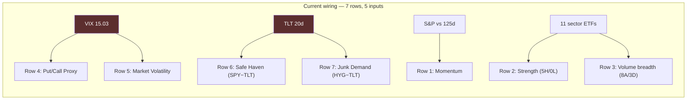

# Fear & Greed Page — Redesign Brief (two questions)

**Session:** Sunday 2026-07-12, late · **Trigger:** page assessment at composite 83 EXTREME GREED
**Scope guard:** this page is display-only — D-005 ruled sentiment is NOT a voter and nothing trades on it. Stakes are low; that buys us the freedom to do it right, not fast. Step 0 (extraction) is mandatory before any change ships.

## The diagnosis: seven rows, five independent inputs

Two structural double-counts, visible in tonight's own screenshot:

- **Rows 4 + 5 are the same instrument.** "Put/Call Proxy" (VIX falling-trend) and "Market Volatility" (VIX vs 50d MA) both transform **VIX 15.03** — the identical raw value appears in both rows. When VIX is low-and-falling (like tonight), ~2/7 of the composite reads greed automatically from one input.
- **Rows 6 + 7 share a leg.** Safe Haven (SPY **vs TLT**) and Junk Bond Demand (HYG **vs TLT**) both key off TLT's 20d return — correlated by construction, and Junk-vs-Treasuries isn't CNN's definition anyway (theirs is junk vs *investment-grade*: the credit-quality spread, not the duration trade).

**The asset nobody's using:** the system already fetches daily data for a **531-ticker universe**. CNN approximates market internals through index proxies because that's what's public; this system can compute the real thing.

---

## Q1 — Component de-duplication: which swaps?

| Option | Change | Cost/benefit |
|---|---|---|
| (a) Minimal | Delete row 5; run 6 components | Kills the VIX double-count; loses a slot; TLT overlap remains |
| **(b) Targeted swaps** | **Row 5 → "% of universe above 50DMA" (true internals, 531 names) · Row 7 → HYG vs LQD (junk vs investment-grade — CNN's actual definition)** | VIX appears once, TLT appears once, two rows upgrade from proxy to universe-computed truth; 7-row structure and equal weights preserved |
| (c) Full redesign | Rebuild all 7 on universe internals | Best data, biggest build, loses CNN comparability |

**Recommendation: (b).** Two surgical swaps, each independently justified: row 5 becomes genuinely independent breadth (and the strongest single addition available — real participation across 531 names), row 7 becomes the honest credit-quality spread. Row 4 keeps its VIX-trend proxy *with its honest label* (options data still doesn't exist here). Result: **7 rows, 7 independent inputs.** Every raw value stays displayed.

## Q2 — Persistence: start the historical series

The page computes-and-forgets. **D-005's F&G-overlay variant is gated on "credible historical daily F&G data" — which doesn't exist publicly. This page can *become* that data.**

**Recommendation:** append `{date, composite, seven components + raws}` to `data/fear_greed_history.json` once per day (post-close run, rides the data commit like every other artifact). Costs ~10 lines; in a year, D-005's gate has a native series behind it — from the *improved* component set if Q1 ships first, which is the right order (log the good formula, not the flawed one). Backfill note: the current formula's history is reconstructable from cached data if ever wanted, but forward-logging the de-duplicated version is the clean start.

---

## Step 0 — extraction (mandatory, ships first or same commit)

The raw→0-100 score mappings are the last undocumented formulas in the system (each row shows raw + score, but the curve between them lives only in code). Extraction to `docs/sentiment.md`: each component's raw definition, scoring curve, band boundaries, composite weighting (confirm equal-weight), update cadence, and the two double-counts recorded as the motivating defects. Same treatment scoring/regime/rules got.

## Process rails

- **Sequencing:** queues in the SAME Claude Code session AFTER R28 stages (one-session rule). Page is display-only and serves via Render, but the freeze stays conservative: **stage tonight if R28 finishes early; push Monday evening alongside R28** after the maiden flights confirm.
- Ships as **D-012** (component swaps are a logic ruling) with retest recipe: once history accumulates, the overlay variant test per D-005; revisit trigger: any component's raw input becoming shared again.
- Extraction lands regardless of Q1's ruling — documenting the current truth is unconditional.

## The two rulings requested

1. **Q1:** minimal / **(b) targeted swaps: row 5 → universe %>50DMA, row 7 → HYG vs LQD** / full redesign ← recommended
2. **Q2:** **daily persistence to fear_greed_history.json, post-close, starting with the new component set** ← recommended
