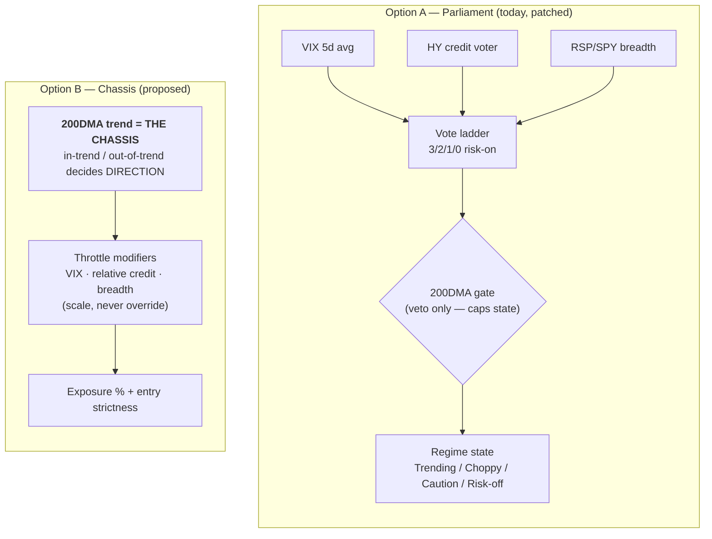
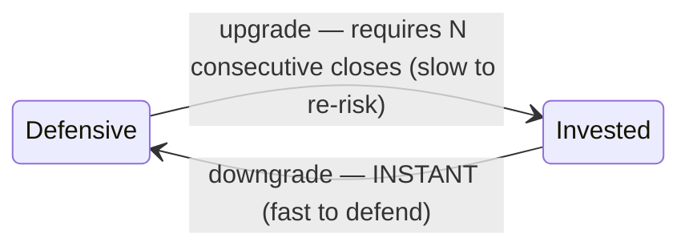
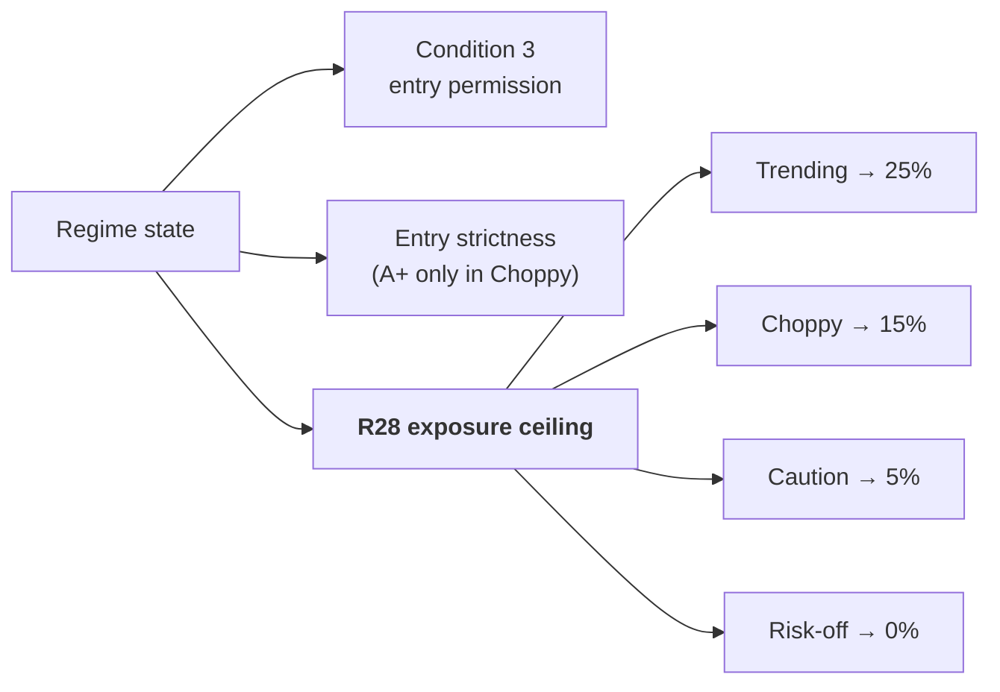

# Gauge B — Design Brief (four questions)

**Session:** Sunday 2026-07-12 · **Evidence base:** Build 4 walk-forward backtest (2015–2026)
**Ground rule:** every answer below is *testable* — the Build 4 harness runs any candidate config in minutes. We are choosing what to send to the harness, not what feels right.

**Build 4's four truths (the inputs to this brief):**

| # | Finding | Number |
|---|---------|--------|
| 1 | Absolute OAS thresholds kept the system uninvested | 9 of 11 years; HY voter cast **zero** risk-on votes 2015–2023; binary strategy 1.85% CAGR vs 13.93% buy-and-hold |
| 2 | The demoted 200DMA gate carried the real signal | Naked 200DMA filter: **9.83% CAGR / 0.68 Sharpe / −19.8% maxDD**, de-risked every crash *while staying invested* |
| 3 | The gauge is a lagging fear meter | Info test inverted: Risk-off days had the **best** forward returns (+1.90% 20d, 70.7% hit) — the state prints at capitulation lows |
| 4 | Trending is a flicker state | 11 of 17 Trending runs lasted ≤ 2 days |

---

## Q1 — Architecture: parliament or chassis?

| | **A — keep the parliament** | **B — invert to chassis** |
|---|---|---|
| Change size | Minimal: fix HY voter, add hysteresis | Structural redesign |
| Philosophy | Three co-equal condition voters, trend as veto | Trend decides direction; conditions decide throttle |
| Build 4 fit | Patches the symptoms | Matches the evidence: the gate had the signal, the voters subtracted |
| Risk | Same architecture that failed, re-tuned | New architecture — needs full harness validation before live |

**Recommendation: B.** The 200DMA de-risked every crash while staying invested; the voters' net contribution was nine missed years. B is also consistent with the July 12 theme ruling: *simple core, discipline as modifiers.* Both A and B go to the harness; B is the lead candidate.

---

## Q2 — The HY measure: which relative shape?

Absolutes are dead (truth #1), and Build 4's grid proved re-tuned absolutes collapse out-of-sample (train Sharpe 1.14 → 0.15). The *shape* of the relative measure is an empirical question:

| Candidate | Definition | Intuition |
|---|---|---|
| **Percentile** | OAS percentile over trailing window (60d / 1y / 2y variants) | "Is credit wide *for its own recent regime*?" — the old HYG/IEF fallback's logic, vindicated |
| **Z-score** | (OAS − trailing mean) / trailing σ | Same idea, continuous, outlier-sensitive |
| **Direction-of-change** | 20d widening / narrowing | "Credit *deteriorating* matters more than credit *wide*" |

**Recommendation: don't pick — send all three (with 2–3 window variants) to the harness** on the locked train (2015–2021) / validate (2022–2026) split. Both numbers reported, always. This is exactly the question the threshold-honesty protocol exists for.

---

## Q3 — Hysteresis mechanics

| Candidate | Upgrades | Downgrades |
|---|---|---|
| Symmetric | N-day confirmation | N-day confirmation |
| **Asymmetric** | **N consecutive closes (e.g. 3)** | **Instant** |
| Dwell-time | Minimum days in any state | Minimum days in any state |

**Recommendation: asymmetric.** It preserves the one thing the current gauge did well (the crash brake — truth #2's companion) and fixes the flicker (truth #4). Symmetric goes to the harness as the control.

---

## Q4 — What the gauge *does* now (post-theme-retirement)

The old action line ("new themes considered") is dead language after the July 12 ruling. The new contract turns regime into a **budget**:

**Recommendation: regime scales R28's total-exposure ceiling** (25 / 15 / 5 / 0%). The gauge's output becomes a *dollar number*, enforced by the same layer as every other discipline. Regime stops being a mood and becomes a budget. (Exact percentages are harness-tunable later; the *wiring* is the decision.)

---

## Process rails

- Production gauge stays live untouched during design — it errs conservative, the safe direction.
- Every candidate validates through the Build 4 harness (train/validate split, both numbers reported) **before** anything ships.
- Winner ships with the extraction pin pattern: `compute_regime()` replay must reproduce recorded production history exactly on the unchanged inputs.
- Gauge Lab already renders whatever `compute_regime()` believes — the moment a new config lands, the lab is automatically correct (flip-distances are probed, not hardcoded).

## The four rulings requested

1. **Q1:** A (patch parliament) or **B (trend chassis)** ← recommended
2. **Q2:** pick a shape, or **harness decides among percentile / z-score / direction** ← recommended
3. **Q3:** symmetric or **asymmetric (instant down, confirmed up)** ← recommended
4. **Q4:** regime as advisory text, or **regime scales R28's dollar ceiling** ← recommended
