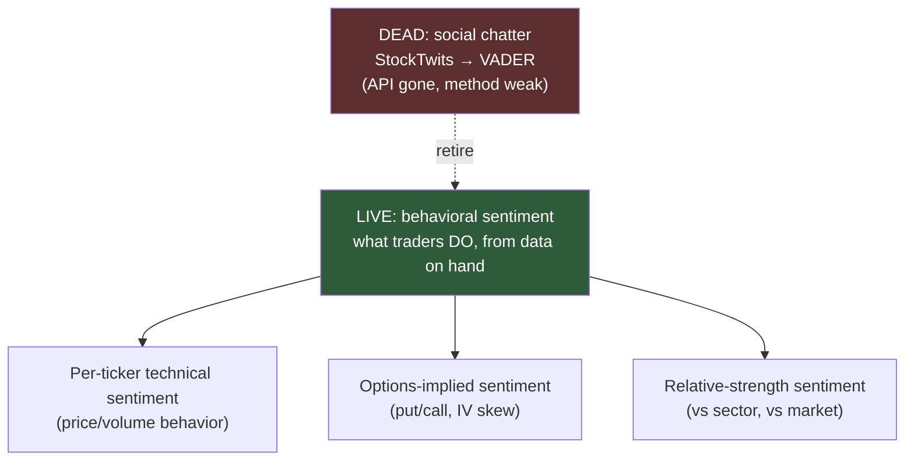

# Sentiment Page — Rebuild Options Brief (revised D-013)

**Session:** 2026-07-13 · **Revision:** user rejected "downgrade to News" — wants real sentiment, rebuilt
**The reframe:** the dead page measured *social chatter* (StockTwits messages → VADER). That data source is gone and the method was weak. But "sentiment" doesn't require social feeds — the **behavioral** sentiment that actually matters for swing trading is encoded in price, volume, and options, all of which this system already fetches. Build sentiment from what traders *do*, not what they *say*.

**Constraint (hard):** no new paid feeds, no ToS-violating scrapes. Every option below computes from data already on hand — the 531-universe daily OHLCV, the VIX complex, and (for the one options row) free options-chain endpoints.

---

## The menu — four buildable sentiment engines

### Option A — Technical Sentiment Score (per ticker, from OHLCV) ⭐ recommended core
A composite 0-100 "behavioral posture" score per ticker, computed entirely from data the engine already has:
- **Distance from 52w high/low** (positioning within the range)
- **Volume-weighted price trend** (are up-days on higher volume? accumulation vs distribution)
- **RSI + MACD posture** (already computed — reuse)
- **Price vs SMA structure** (already computed)
- **20d return percentile vs its own history** (is it hot or cold *for itself*)

This is honest, per-ticker, always-available, and — crucially — **it's the F&G methodology applied at ticker granularity.** Where F&G reads the whole market's mood, this reads one name's. Buckets (Accumulation / Neutral / Distribution) replace the dead Bullish/Bearish/Trending, computed not scraped.

### Option B — Options-Implied Sentiment (per ticker) ⭐ strongest signal, one dependency
The purest *real* sentiment: what the options market is paying for.
- **Put/Call ratio** (volume and open-interest) — free from yfinance `.option_chain()` or CBOE delayed
- **IV skew** — are puts bid over calls (fear) or calls over puts (greed/chase)?
- **IV rank** — is implied vol high or low vs its own year?

This is the row the dead page *faked* with a "Put/Call Proxy" (VIX substitute). Option B makes it real, per ticker. Dependency: options-chain fetches are heavier and flakier than OHLCV — needs the same graceful-degradation pattern (missing chain → row omitted, never crash). Best scoped to holdings + watchlist + top universe names, not all 531.

### Option C — Relative Strength Sentiment (per ticker vs sector vs market)
- Ticker's 20d return **vs its GICS group** (leading or lagging its peers?)
- Ticker's 20d return **vs SPY** (alpha positive or negative?)
- Group's return **vs market** (is the whole neighborhood in favor?)

Cheap (pure return math on data already fetched), and it directly feeds the post-theme-retirement world — "is this name the strength or the laggard in a leading group" is exactly the A+ doctrine's group-health question in sentiment form.

### Option D — News headlines as a *supporting* panel (not the main event)
Keep real headlines (yfinance `.news`) as a **context strip** beneath the computed sentiment — not as the sentiment itself. Earnings chips, catalyst awareness. This is the "News" idea demoted to where it belongs: supporting evidence, not the headline feature.

---

## Recommended build: **A + C now, B next, D as a strip**

| Layer | What | Cost | When |
|---|---|---|---|
| **Technical Sentiment (A)** | Per-ticker 0-100 behavioral score + Accumulation/Neutral/Distribution buckets, all from existing OHLCV/indicators | Low — reuses computed fields | **This build** |
| **Relative Strength (C)** | vs-group + vs-market rows per ticker | Low — return math | **This build** |
| **Options-Implied (B)** | Put/Call + IV skew, holdings+watchlist+leaders scope | Medium — new fetch path, graceful degrade | **Follow-up** (its own commit, after the fetch reliability is proven) |
| **News strip (D)** | Headlines + earnings chips as supporting context | Low | **This build** (bottom strip) |

**Why this ordering:** A + C are computable *tonight* from data already in hand with zero new failure modes — they resurrect the page as a real, honest sentiment tool immediately. B is the strongest single signal but introduces a flaky fetch path that deserves its own commit and its own graceful-degradation testing (the lesson from every data-source-death this project has hit). D rides along cheaply as the context it always should have been.

**The page becomes:** a per-ticker **Behavioral Sentiment** analyzer — search a ticker, get its Technical Sentiment score (0-100, bucketed), its relative strength vs group and market, and a headline strip — with Options-Implied sentiment added in the follow-up. Every number computed, every source honest, nothing scraped.

---

## Process rails
- Ships as **D-013 (revised)** — the retirement of VADER/StockTwits still happens (obituary in docs/sentiment.md, deps deleted), but the page is *rebuilt*, not downgraded. The revised ruling supersedes the "downgrade to News" recommendation.
- **Lab pattern applies:** the Technical Sentiment score is a pure function → gets a simulate endpoint → eventually a Sentiment Lab (twist the inputs). Consistent with D-010.
- **Extraction first (Step 0):** document what the dead page computed before deleting it (the last un-extracted surface), shared with the F&G extraction in docs/sentiment.md.
- **Retest/revisit:** Option B's put/call data, once flowing, is a candidate input to revisit D-005 (sentiment-as-signal) — but that stays display-only until a ruled consumer exists, same gate as F&G.

## The rulings requested
1. **Scope:** **A + C + D-strip this build, B as follow-up** ← recommended · or a different subset
2. **Bucket names:** **Accumulation / Neutral / Distribution** (behavioral) ← recommended · or keep Bullish/Bearish/Trending
3. **Options (B):** follow-up commit ← recommended · or fold into this build · or skip entirely
