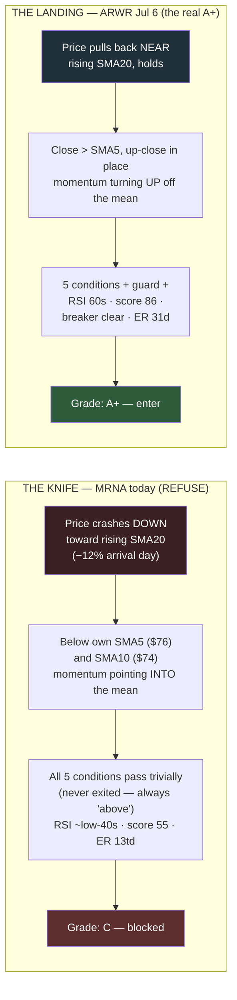

# D-011 — The A+ Doctrine: a computed setup grade

| | |
|---|---|
| **ID** | D-011 |
| **Date** | 2026-07-12 (proposed and ruled same day — session part 3, final) |
| **Status** | **Ruled** |

## Context

"New entries only on A+ setups" (the Choppy regime action line) had no
definition — A+ lived in the trader's head. The trigger, live on
2026-07-12: MRNA showed five green pips with the extension guard
legitimately passing at 0.43×ATR (the [D-004](D-004-extension-guard.md)
release event itself fired intraday on Jul 10 at 0.49×, per the recorded
position event) — and was still obviously not a buy. The structural gap: conditions 1–2 confirm a
*reclaim after an exit*; a name that never exited and **falls down onto**
its rising SMA20 passes them trivially. The extension guard fixed
too-far-above (item 20); this doctrine closes arriving-from-above.

Deliberation source: [docs/briefs/aplus-doctrine-brief.md](../briefs/aplus-doctrine-brief.md)
(deliberation 3 of 3, 2026-07-12).

## Evidence — the two live exhibits (from the brief; two MRNA cells
corrected against the recorded artifact, marked †)

| | ARWR Jul 6 (the A+ taken) | MRNA Jul 12 (the READY to refuse) |
|---|---|---|
| 5 conditions | all met | all met |
| Extension | 1.64×ATR healthy trending | 0.43×ATR — *at* the mean |
| Approach | rising into entry (close > SMA5 > SMA10) | falling knife (close $68.27 below SMA5 ~$76, SMA10 ~$74; −12% arrival) |
| RSI | ~60s | **55** † (in the 45–70 band; the brief estimated ~low-40s — artifact `rsi_14`) |
| Quality score | 86–89 (strong-buy band) | 55 (hold band), outranked |
| Group health | Biotech loaded with strong-buys | Biotech stopped out the whole deployment 2 days prior |
| Earnings runway | 31 days | earnings 2026-07-31 † — **14 sessions before the print** (amendment-2 convention), failing the ≥15 bar |

Same five green pips, opposite momentum through the mean
(source: [docs/briefs/knife-vs-landing.mermaid](../briefs/knife-vs-landing.mermaid)):



*(Diagram quoted verbatim from the brief exhibit. Its RSI annotation
carries the brief's estimate — the recorded artifact prints RSI 55.
Its "ER 13td" annotation predates amendment 2 — the recorded figure is
14 sessions strictly before the 2026-07-31 print. Its "Grade: C"
annotation, which predated the grade algorithm, is now CORRECT under
amendment 1's C-escalation clause — the knife's approach failure is
exactly what escalates; see the fact-check note.)*

## Rulings (PER-508 comment 11716 — all four as recommended)

- **Q1 — Approach filter: COMPOSITE.** At entry: close > SMA5 **and** at
  least one up-close since the swing low. Encodes "buy the first
  evidence of the turn, never the red knife day." Variants (slope pair,
  longer stabilization windows) → Build 5 retest.
- **Q2 — Required checklist: the seven as written.** (1) five mechanical
  conditions · (2) extension ≤ 1.8×ATR (existing guard) · (3) approach
  filter per Q1 · (4) RSI 45–70 at entry · (5) quality score ≥ 75
  (strong-buy band; waived for index vehicles along with group rows) ·
  (6) group breaker clear · (7) earnings runway per Q3 — **sessions
  strictly BEFORE the print day; the print is not runway** (amendment 2).
  All else advisory. **Grade computation (as amended 2026-07-12):**
  all seven → **A+**; conditions + guard pass but any of items 4–7
  fail → **B** (failing reasons named); **approach-filter failure
  (item 3) escalates to C — blocked in every regime, including
  Trending** (amendment 1; rationale on record: Q4 permits B entries
  in Trending, and a B-graded knife would be a permitted knife,
  contradicting the doctrine's founding case); mechanical conditions
  fail → **C/blocked**.
- **Q3 — Earnings runway: ≥ 15 trading days (~3 weeks) for A+.** A
  2–6-week swing entered inside that straddles the binary by
  construction. R8's ≤7d chip remains the warning tier. Names
  re-qualify after the print. Convention (amendment 2): runway counts
  trading sessions **strictly before the print day**. **Live
  consequence, now computing consistently: MRNA grades C today** —
  the approach-filter failure (below own SMA5/10) escalates to C per
  amendment 1, with score (55), group health, and runway (14 sessions
  before the Jul 31 print, failing the ≥15 bar) as further named
  failures.
- **Q4 — Enforcement: hard gate in Choppy/Caution** — RE_ENTRY_READY
  requires grade A+; otherwise `READY (B — reasons)` rendered
  blocked-amber, the same visual law as EXTENDED_HOLD. **Advisory in
  Trending** — grade displayed, B entries permitted (the regime is the
  throttle per [D-008](D-008-gauge-b-architecture.md) Q4). Grade +
  failing reasons emitted in signals.json/assessment.json, rendered on
  the panel, twistable in the Position Lab — the grade computes
  server-side from the same pure function (Lab law 1,
  [D-010](D-010-lab-pattern-laws.md)).

## Fact-check note — two in-ruling discrepancies, found and adjudicated

The registry's fact-check pass found two discrepancies **inside the
ruling itself** before this record shipped; both were carried openly as
adjudication items and **both were ruled the same day** — the
registry's designed lifecycle (find → flag → adjudicate → amend)
completing its first full cycle:

1. **The C-vs-B contradiction → C-ESCALATION CLAUSE (amendment 1).**
   As originally ruled, Q2 computed **B** for MRNA (conditions + guard
   pass; failures all in the 3–7 band) while the ruling recorded
   **C**. Adjudicated: approach-filter failure (item 3) escalates the
   grade to C — blocked in every regime, including Trending. Rationale
   on record: Q4 permits B entries in Trending; a B-graded knife would
   be a permitted knife, contradicting the doctrine's founding case.
   All other 3–7 failures remain B rows. The worked example now
   computes consistently.
2. **The runway count → CONVENTION RULED (amendment 2).** The ruling
   recorded ~13 trading days; the artifact's 2026-07-31 print allows
   15 sessions counting inclusively. Adjudicated: runway counts
   trading sessions **strictly before the print day** (the print is
   not runway) — MRNA = 14 sessions, failing the ≥15 bar. The
   convention is recorded in the Q2 checklist row.

## Consequences

Implementation is a 1B extension (a pure, parameterized grade function
beside `assess_position`), landing after R28 (Phase 0 of
[D-007](D-007-theme-layer-retirement.md)) and riding Phase 1's
condition-5 rewire. The doctrine is a **hypothesis until the Build 5
replay reports** — enforcement ships, but its edge is unproven until
graded history exists.

## Revisit triggers (per the ruling)

1. A+ entries underperforming B in the Build 5 replay.
2. Healthy setups repeatedly graded B on a single named row — the
   threshold-miscalibration signal.

## Retest recipe

```
# Build 5 grades every historical entry (the trader's own + universe
# replay): do A+-graded entries outperform B/C on forward returns and
# stop-out rate?
python3 scripts/replay_ticker.py --grade-entries   # (Build 5 deliverable)
# The grade function, once shipped, pins like every 1B rule:
python3 test_position_signals.py
python3 test_position_lab.py
```

## Links

- Jira: PER-508 comment 11716 (the rulings, verbatim source) · 11710 (item 20, the sibling guard)
- Brief: [docs/briefs/aplus-doctrine-brief.md](../briefs/aplus-doctrine-brief.md) · diagram: docs/briefs/knife-vs-landing.mermaid
- Related: [D-003](D-003-1b-position-engine.md) (the machine extended) · [D-004](D-004-extension-guard.md) (too-far-above) · [D-007](D-007-theme-layer-retirement.md) (phase order) · [D-008](D-008-gauge-b-architecture.md) (Q4 throttle) · [D-010](D-010-lab-pattern-laws.md) (lab laws)
