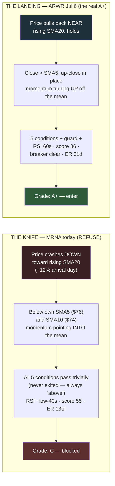

# D-011 — The A+ Doctrine: a computed setup grade

| | |
|---|---|
| **ID** | D-011 |
| **Date** | 2026-07-12 (proposed) |
| **Status** | **Proposed** — four rulings requested, none yet made |

Parked with its retest recipe per the lifecycle's Proposed path — like
[D-009](D-009-exit-timing-1230.md), the test is written before the gate
opens.

## Context

"New entries only on A+ setups" (the Choppy regime action line) has no
definition — A+ lives in the trader's head. The trigger, live on
2026-07-12: MRNA showed five green pips with the extension guard
legitimately released at 0.43×ATR ([D-004](D-004-extension-guard.md)'s
recorded production release was the prior close's 0.49×) — and was still
obviously not a buy. The structural gap: conditions 1–2 confirm a
*reclaim after an exit*; a name that never exited and **falls down onto**
its rising SMA20 passes them trivially. The extension guard fixed
too-far-above (item 20); this doctrine addresses arriving-from-above.

Deliberation source (all proposals below are the brief's, verbatim in
substance): [docs/briefs/aplus-doctrine-brief.md](../briefs/aplus-doctrine-brief.md).

## Evidence — the two live exhibits (from the brief)

| | ARWR Jul 6 (the A+ taken) | MRNA Jul 12 (the READY to refuse) |
|---|---|---|
| 5 conditions | all met | all met |
| Extension | 1.64×ATR healthy trending | 0.43×ATR — *at* the mean |
| Approach | rising into entry (close > SMA5 > SMA10) | falling knife (close $68.27 below SMA5 ~$76, SMA10 ~$74; −12% arrival) |
| RSI | ~60s | ~low-40s post-crash |
| Quality score | 86–89 (strong-buy band) | 55 (hold band), outranked |
| Group health | Biotech loaded with strong-buys | Biotech stopped out the whole deployment 2 days prior |
| Earnings runway | 31 days | ~13 trading days |

The knife-vs-landing shape (source:
[docs/briefs/knife-vs-landing.mermaid](../briefs/knife-vs-landing.mermaid)):



## The four rulings requested (brief's recommendations marked; NONE ruled)

1. **Q1 — approach filter:** (a) SMA5 reclaim / (b) slope pair /
   (c) stabilization day / **(d) composite: SMA5 reclaim + up-close ←
   recommended** (sma5 ships in the payload since f983fce)
2. **Q2 — required checklist:** the seven items as written (5 conditions
   · extension guard · approach filter · RSI 45–70 · quality ≥75 ·
   group breaker clear · earnings runway) → A+; guard-clean but any of
   3–7 failing → B with named reasons; conditions failing → C/blocked
   **← recommended as written**
3. **Q3 — earnings runway:** 10 / **15 ← recommended** / 21 trading
   days. Stated honestly in the brief: MRNA at ~13 trading days fails
   the recommended bar today — which matches the instinct being encoded
4. **Q4 — enforcement:** **hard gate in Choppy/Caution** (READY requires
   A+; otherwise `READY (B — reasons…)` rendered blocked-amber, the
   EXTENDED_HOLD visual law), **advisory in Trending** (the regime is
   the throttle per [D-008](D-008-gauge-b-architecture.md) Q4),
   twistable in the Position Lab always **← recommended**

## Consequences (of the proposal)

Implementation is a 1B extension (a pure, parameterized grade function
beside `assess_position` — Lab law 1 from day one,
[D-010](D-010-lab-pattern-laws.md)), not a rewrite; lands after R28
(Phase 0 of [D-007](D-007-theme-layer-retirement.md)), likely with
Phase 1's condition-5 rewire.

## Revisit triggers

The gate for ruling: the four rulings landing (PER-508 comment /
registry amendment). Post-ruling trigger, pre-written per the brief:
the doctrine is a hypothesis until the Build 5 replay says otherwise.

## Retest recipe

Pre-written (Build 5 deliverable, marked as such):

```
# Build 5 grades every historical entry (the trader's own + universe
# replay) and reports whether A+-graded entries outperform B/C on
# forward returns and stop-out rate:
python3 scripts/replay_ticker.py --grade-entries   # (Build 5 deliverable)
# The grade function itself, once shipped, pins like every 1B rule:
python3 test_position_signals.py
python3 test_position_lab.py
```

## Links

- Brief: [docs/briefs/aplus-doctrine-brief.md](../briefs/aplus-doctrine-brief.md) (deliberation 3 of 3, 2026-07-12)
- Diagram: docs/briefs/knife-vs-landing.mermaid
- Related: [D-003](D-003-1b-position-engine.md) (the machine being extended) · [D-004](D-004-extension-guard.md) (the too-far-above guard) · [D-007](D-007-theme-layer-retirement.md) (phase order) · [D-008](D-008-gauge-b-architecture.md) (Q4 regime throttle) · [D-010](D-010-lab-pattern-laws.md) (lab laws)
