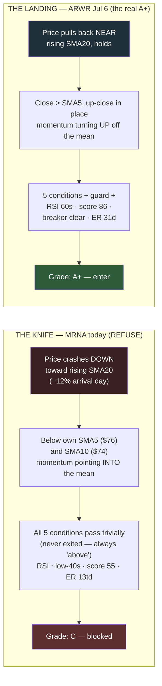

# D-011 — The A+ Doctrine: a computed setup grade

| | |
|---|---|
| **ID** | D-011 |
| **Date** | 2026-07-12 (proposed and ruled same day — session part 3, final) |
| **Status** | **Ruled** |

## Context

"New entries only on A+ setups" (the Choppy regime action line) had no
definition — A+ lived in the trader's head. The trigger, live on
2026-07-12: MRNA showed five green pips with the extension guard
legitimately passing at 0.43×ATR (the [D-004](D-004-extension-guard.md)
release event itself fired intraday on Jul 10 at 0.49×, per the recorded
position event) — and was still obviously not a buy. The structural gap: conditions 1–2 confirm a
*reclaim after an exit*; a name that never exited and **falls down onto**
its rising SMA20 passes them trivially. The extension guard fixed
too-far-above (item 20); this doctrine closes arriving-from-above.

Deliberation source: [docs/briefs/aplus-doctrine-brief.md](../briefs/aplus-doctrine-brief.md)
(deliberation 3 of 3, 2026-07-12).

## Evidence — the two live exhibits (from the brief; two MRNA cells
corrected against the recorded artifact, marked †)

| | ARWR Jul 6 (the A+ taken) | MRNA Jul 12 (the READY to refuse) |
|---|---|---|
| 5 conditions | all met | all met |
| Extension | 1.64×ATR healthy trending | 0.43×ATR — *at* the mean |
| Approach | rising into entry (close > SMA5 > SMA10) | falling knife (close $68.27 below SMA5 ~$76, SMA10 ~$74; −12% arrival) |
| RSI | ~60s | **55** † (in the 45–70 band; the brief estimated ~low-40s — artifact `rsi_14`) |
| Quality score | 86–89 (strong-buy band) | 55 (hold band), outranked |
| Group health | Biotech loaded with strong-buys | Biotech stopped out the whole deployment 2 days prior |
| Earnings runway | 31 days | earnings 2026-07-31 † — 15 sessions to the print (the ruling recorded ~13; see fact-check note) |

Same five green pips, opposite momentum through the mean
(source: [docs/briefs/knife-vs-landing.mermaid](../briefs/knife-vs-landing.mermaid)):



*(Diagram quoted verbatim from the brief exhibit; its RSI and grade
annotations carry the brief's estimates — the recorded artifact prints
RSI 55, and the C-vs-B grade is one of the two adjudication items in
the fact-check note below.)*

## Rulings (PER-508 comment 11716 — all four as recommended)

- **Q1 — Approach filter: COMPOSITE.** At entry: close > SMA5 **and** at
  least one up-close since the swing low. Encodes "buy the first
  evidence of the turn, never the red knife day." Variants (slope pair,
  longer stabilization windows) → Build 5 retest.
- **Q2 — Required checklist: the seven as written.** (1) five mechanical
  conditions · (2) extension ≤ 1.8×ATR (existing guard) · (3) approach
  filter per Q1 · (4) RSI 45–70 at entry · (5) quality score ≥ 75
  (strong-buy band; waived for index vehicles along with group rows) ·
  (6) group breaker clear · (7) earnings runway per Q3. All else
  advisory. **Grade computation:** all seven → **A+**; conditions +
  guard pass but any of 3–7 fail → **B** (failing reasons named);
  conditions fail → **C/blocked**.
- **Q3 — Earnings runway: ≥ 15 trading days (~3 weeks) for A+.** A
  2–6-week swing entered inside that straddles the binary by
  construction. R8's ≤7d chip remains the warning tier. Names
  re-qualify after the print. **Live consequence at ruling time, as
  recorded in the ruling: "MRNA grades C today"** — fails approach
  (below own SMA5/10), score (55), group health, and runway (recorded
  as ~13 trading days). *Both the C grade and the runway count are
  flagged in the fact-check note below — the algorithm as ruled
  computes B, and the artifact counts 15 sessions.*
- **Q4 — Enforcement: hard gate in Choppy/Caution** — RE_ENTRY_READY
  requires grade A+; otherwise `READY (B — reasons)` rendered
  blocked-amber, the same visual law as EXTENDED_HOLD. **Advisory in
  Trending** — grade displayed, B entries permitted (the regime is the
  throttle per [D-008](D-008-gauge-b-architecture.md) Q4). Grade +
  failing reasons emitted in signals.json/assessment.json, rendered on
  the panel, twistable in the Position Lab — the grade computes
  server-side from the same pure function (Lab law 1,
  [D-010](D-010-lab-pattern-laws.md)).

## Fact-check note — two items in the ruling awaiting adjudication

The registry's fact-check pass (run before this record shipped) found
two discrepancies **inside the ruling itself** — recorded here rather
than silently resolved, per the standing rule:

1. **"MRNA grades C today" contradicts the ruled algorithm.** Per Q2 as
   ruled: conditions + guard pass but any of items 3–7 fail → **B**;
   only failing the mechanical conditions yields C. MRNA passes all
   five conditions and the guard (artifact: 5/5, 0.43×ATR), and its
   named failures (approach, score, group health, runway) are all in
   the 3–7 band — the algorithm as written computes **B**, while the
   ruling records **C**. Either the worked example should read B
   (blocked identically in Choppy under Q4), or the algorithm needs a
   C-escalation clause (e.g., approach-filter failure or ≥N failing
   rows → C). Adjudication requested; implementation blocks on it only
   for the B/C boundary, not for the gate behavior.
2. **The runway count.** The artifact records MRNA earnings
   2026-07-31 — 15 trading sessions from the next session (Jul 13),
   not the ruling's ~13. At the ruled ≥15 bar this sits AT the line,
   so whether runway is a named failure depends on the counting
   convention (inclusive of the print day or not) — unruled. The other
   three named failures stand regardless; MRNA's refusal is not in
   question, only which rows are cited.

## Consequences

Implementation is a 1B extension (a pure, parameterized grade function
beside `assess_position`), landing after R28 (Phase 0 of
[D-007](D-007-theme-layer-retirement.md)) and riding Phase 1's
condition-5 rewire. The doctrine is a **hypothesis until the Build 5
replay reports** — enforcement ships, but its edge is unproven until
graded history exists.

## Revisit triggers (per the ruling)

1. A+ entries underperforming B in the Build 5 replay.
2. Healthy setups repeatedly graded B on a single named row — the
   threshold-miscalibration signal.

## Retest recipe

```
# Build 5 grades every historical entry (the trader's own + universe
# replay): do A+-graded entries outperform B/C on forward returns and
# stop-out rate?
python3 scripts/replay_ticker.py --grade-entries   # (Build 5 deliverable)
# The grade function, once shipped, pins like every 1B rule:
python3 test_position_signals.py
python3 test_position_lab.py
```

## Links

- Jira: PER-508 comment 11716 (the rulings, verbatim source) · 11710 (item 20, the sibling guard)
- Brief: [docs/briefs/aplus-doctrine-brief.md](../briefs/aplus-doctrine-brief.md) · diagram: docs/briefs/knife-vs-landing.mermaid
- Related: [D-003](D-003-1b-position-engine.md) (the machine extended) · [D-004](D-004-extension-guard.md) (too-far-above) · [D-007](D-007-theme-layer-retirement.md) (phase order) · [D-008](D-008-gauge-b-architecture.md) (Q4 throttle) · [D-010](D-010-lab-pattern-laws.md) (lab laws)
