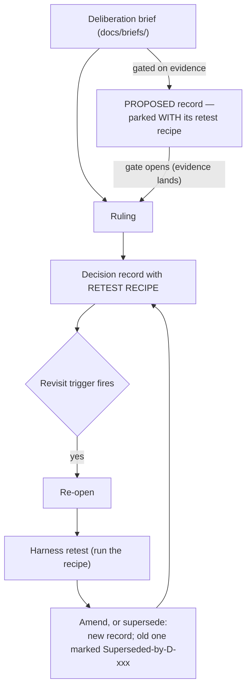

# Decision Registry

Every design decision that shapes what this system trades on lives here
as a record with its evidence, its revisit triggers, and the exact recipe
to re-run that evidence. The pattern is ADR (architecture decision
records) plus one hard addition: **retest recipes** — a ruling you cannot
re-derive is a ruling you cannot trust when conditions change.

**The standing rule:** "No design change ships without a decision record;
no record without a revisit trigger; no ruling without its evidence
linked."

Deliberation briefs (the pre-ruling analysis documents) live in
[`docs/briefs/`](../briefs/); records link back to theirs.

## Lifecycle

## Index

| ID | Title | Date | Status | Superseded by |
|---|---|---|---|---|
| [D-001](D-001-swing-gauge-1a.md) | Build 1A swing gauge — 3 voters + backdrop gate + exact-spec ladder | 2026-07-05 | Ruled — **revisit fired 2026-07-11**; successor architecture ruled (D-008), supersession lands when Gauge B ships | — (pending Gauge B build) |
| [D-002](D-002-r4-sunday-cadence.md) | R4 Sunday-cadence qualification, 2 degraded weekly closes | 2026-07-05 | Ruled | — |
| [D-003](D-003-1b-position-engine.md) | 1B position engine — 5 conditions, close-basis stops, positions.json authoritative | 2026-07-05 | Ruled | — |
| [D-004](D-004-extension-guard.md) | Extension guard @ 1.8×ATR | 2026-07-09 | Ruled | — |
| [D-005](D-005-sentiment-not-a-voter.md) | Sentiment is not a voter; F&G overlay gated on credible data | 2026-07-06 | Ruled | — |
| [D-006](D-006-build4-protocol.md) | Build 4 backtest protocol (reusable) | 2026-07-11 | Ruled | — |
| [D-007](D-007-theme-layer-retirement.md) | Theme layer retirement — scanner + quality gate as thesis, R28 dollars, Option C staged | 2026-07-12 | Ruled | — |
| [D-008](D-008-gauge-b-architecture.md) | Gauge B architecture (Q1–Q4: trend chassis, harness-decided credit shape, asymmetric hysteresis, regime-scaled R28 ceiling 90/50/25/5) | 2026-07-12 | Ruled | — |
| [D-009](D-009-exit-timing-1230.md) | Exit timing — 12:30 intraday checkpoint | 2026-07-11 | **Proposed** — gated on Build 5 evidence | — |
| [D-010](D-010-lab-pattern-laws.md) | The Lab pattern three laws | 2026-07-11 | Ruled | — |
| [D-011](D-011-aplus-doctrine.md) | The A+ Doctrine — computed setup grade (composite approach filter, 7-item checklist, ≥15td earnings runway, hard-gate Choppy/Caution) | 2026-07-12 | Ruled | — |

Status meanings: **Proposed** (deliberation open or parked with its
retest recipe) · **Ruled** (in force) · **Superseded-by-D-xxx** (kept for
the record; the successor governs) · **Retired** (no successor needed —
the decided-about thing no longer exists).
