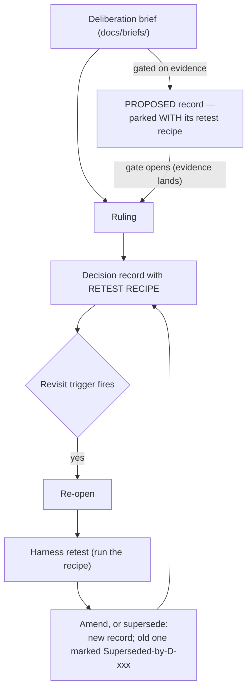

# Decision Registry

Every design decision that shapes what this system trades on lives here
as a record with its evidence, its revisit triggers, and the exact recipe
to re-run that evidence. The pattern is ADR (architecture decision
records) plus one hard addition: **retest recipes** — a ruling you cannot
re-derive is a ruling you cannot trust when conditions change.

**The standing rule:** "No design change ships without a decision record;
no record without a revisit trigger; no ruling without its evidence
linked."

**How decisions get judged here:** every record stores its options
considered and a retest recipe — stored counterfactuals. The method
itself is taught in
[the counterfactual-reasoning explainer](../explainers/counterfactual-reasoning.md)
(change the DECISION, never the INFORMATION).

Deliberation briefs (the pre-ruling analysis documents) live in
[`docs/briefs/`](../briefs/); records link back to theirs.

The direction these records serve — plus a dated changelog of what has landed — is
in [`docs/NORTH-STAR.md`](../NORTH-STAR.md).

## Lifecycle

```mermaid
flowchart TD
    B["Deliberation brief (docs/briefs/)"] --> R["Ruling"]
    B -->|"gated on evidence"| P["PROPOSED record —
    parked WITH its retest recipe"]
    P -->|"gate opens (evidence lands)"| R
    R --> D["Decision record with RETEST RECIPE"]
    D --> T{"Revisit trigger fires"}
    T -->|yes| O["Re-open"]
    O --> H["Harness retest (run the recipe)"]
    H --> A["Amend, or supersede:
    new record; old one marked Superseded-by-D-xxx"]
    A --> D
```

## Index

| ID | Title | Date | Status | Superseded by |
|---|---|---|---|---|
| [D-001](D-001-swing-gauge-1a.md) | Build 1A swing gauge — 3 voters + backdrop gate + exact-spec ladder | 2026-07-05 | Ruled — **revisit fired 2026-07-11**; successor architecture ruled (D-008), supersession lands when Gauge B ships | — (pending Gauge B build) |
| [D-002](D-002-r4-sunday-cadence.md) | R4 Sunday-cadence qualification, 2 degraded weekly closes | 2026-07-05 | Ruled | — |
| [D-003](D-003-1b-position-engine.md) | 1B position engine — 5 conditions, close-basis stops, positions.json authoritative | 2026-07-05 | Ruled | — |
| [D-004](D-004-extension-guard.md) | Extension guard @ 1.8×ATR | 2026-07-09 | Ruled | — |
| [D-005](D-005-sentiment-not-a-voter.md) | Sentiment is not a voter; F&G overlay gated on credible data | 2026-07-06 | Ruled | — |
| [D-006](D-006-build4-protocol.md) | Build 4 backtest protocol (reusable) | 2026-07-11 | Ruled | — |
| [D-007](D-007-theme-layer-retirement.md) | Theme layer retirement — scanner + quality gate as thesis, R28 dollars, Option C staged | 2026-07-12 | Ruled | — |
| [D-008](D-008-gauge-b-architecture.md) | Gauge B architecture (Q1–Q4: trend chassis, harness-decided credit shape, asymmetric hysteresis, regime-scaled R28 ceiling 90/50/25/5) | 2026-07-12 | Ruled | — |
| [D-009](D-009-exit-timing-1230.md) | Exit timing — 12:30 intraday checkpoint | 2026-07-11 | **Proposed** — gated on Build 5 evidence | — |
| [D-010](D-010-lab-pattern-laws.md) | The Lab pattern three laws | 2026-07-11 | Ruled | — |
| [D-011](D-011-aplus-doctrine.md) | The A+ Doctrine — computed setup grade (composite approach filter, 7-item checklist, ≥15td earnings runway, hard-gate Choppy/Caution) | 2026-07-12 | Ruled | — |
| [D-012](D-012-fear-greed-rebuild.md) | Fear & Greed de-duplication (7 rows → 7 independent inputs) + daily persistence | 2026-07-13 | Ruled | — |
| [D-013](D-013-sentiment-rebuild.md) | Sentiment rebuilt as per-ticker behavioral analysis (Technical Sentiment + relative strength + news; VADER/StockTwits retired) | 2026-07-13 | Ruled | — |
| [D-014](D-014-tradingview-data-api.md) | TradingView Data API as a candidate yfinance replacement | 2026-07-13 | **Proposed** — parked (gated on a free-tier spike, gated on a trigger) | — |
| [D-015](D-015-oss-frameworks-survey.md) | Survey serious OSS trading frameworks for borrowable techniques (harvest, don't migrate) | 2026-07-13 | **Proposed** — parked (gated on the build queue clearing) | — |
| [D-016](D-016-extreme-fear-overlay.md) | Extreme-fear contrarian entry overlay — backtest-gated hypothesis (ruled exception to D-011 ONLY if it survives the full 11yr sample) | 2026-07-13 | **Proposed** — parked (gated on machinery free + F&G reconstruction appetite) | — |
| [D-017](D-017-candidates-tier.md) | Candidates tier — auto-grade every signals.json name (grade without a state); chip-only display; copy-the-prompt +watch; close-report line | 2026-07-18 | Ruled | — |
| [D-018](D-018-close-basis-position-ladder.md) | The close-basis law extends to the position ladder — transitions only on confirmed closes; intraday previews, never transitions; gap-proof catch-up replay | 2026-07-23 | Ruled | — |
| [D-019](D-019-breaker-coverage.md) | Breaker coverage, not outcome — an outage never impersonates safety; three flavours of incomplete; trigger still wins | 2026-07-25 | Ruled | — |
| [D-020a](D-020a-ytd-anchor-cap.md) | One honest YTD — real prior-year-close anchor on both paths; YTD component capped flat at the curve's peak above it; scorer versioned (v1 frozen with three pinned anchors) | 2026-08-09 | Ruled | — |
| [D-022](D-022-unmeasurable-market-cap.md) | An unmeasurable market cap is not a small company — `mcap_unavailable` split from `failed_mcap_gate`, coverage record, and a rotation that refuses when missing caps change the book | 2026-08-11 | Ruled | — |
| [D-023](D-023-classification-aliases.md) | A vendor label is a group nobody can reach — whole-pool sweep against a committed GICS vocabulary; 5 aliases added, 3 labels declared unmappable-by-alias; a local sweep under-reports vs CI | 2026-08-11 | **Proposed** — staged, held for push approval | — |

Also in this directory: [CHAT-RULINGS](CHAT-RULINGS.md) — the living
registry of operator rulings issued in session (scope calls,
interpretive-step approvals, standing caveats) that bind the work but
have not earned a full D-record; entries promote to D-records when
they grow one.

## SHA re-anchoring (2026-08-09 rebase over cron)

Pushing the 2026-08-08/09 build stack required a rebase over 69 cron
commits, which rewrote the commit SHAs that the study pins and the
frozen pre-registration records cite. The frozen records keep their
original text by design — a content-pinned record is never rewritten
post-hoc — so anyone grepping for an old SHA lands here:

| Cited (pre-rebase) | On main as | What it is |
|---|---|---|
| `2f98eb0` | `7ea58bc` | Build 5.1 pre-registration |
| `29399ce` | `2610481` | Build 5.1 row ablation |
| `d184ced` | `6b504ba` | Build 6A pre-registration |
| `6bbca06` | `e223204` | Build 6A implementation declarations |
| `a319b45` | `ecd3e0e` | Build 6A profit-target sweep |
| `4dd5929` | `5771878` | D-020a scorer change |
| `cdcfa19` | `b02ccb5` | Build 5.2 pre-registration (2026-08-14 rebase; prereg blob byte-identical across the pair) |

The re-anchoring commit is `75a19ef`; the immutability pins compare
against the post-rebase SHAs, and the pinned CONTENT is identical
across the mapping.

The `cdcfa19` row is the 2026-08-14 instance of the same class: the
Build 5.2 script, results JSON and report cite `cdcfa19`, which the
push-day rebase rewrote to `b02ccb5` — the cited SHA exists only in
the authoring machine's reflog. Unlike the rows above, the citing
artifacts have NOT been re-anchored (75a19ef's precedent edits them;
that is its own change, not made here), and 5.2 has no standing pin
file yet, so nothing currently FAILS on a clone — the citation is a
dangling breadcrumb, not a broken pin. This table is the resolution
path for anyone who greps it.

Status meanings: **Proposed** (deliberation open or parked with its
retest recipe) · **Ruled** (in force) · **Superseded-by-D-xxx** (kept for
the record; the successor governs) · **Retired** (no successor needed —
the decided-about thing no longer exists).
