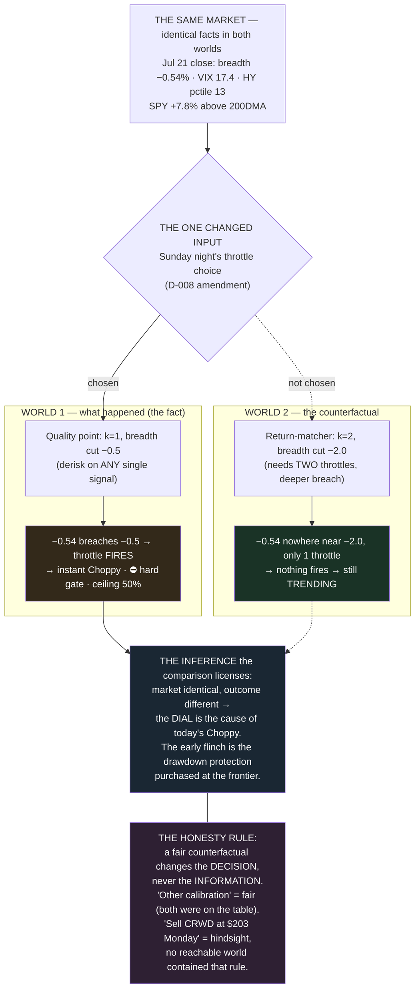

# Explainer — Counterfactual Reasoning (how decisions get judged here)

**Genre:** methodology explainer · **Illuminates:** the decision registry's evaluation philosophy, D-006's protocol, every backtest

## Definition

A counterfactual answers **"what would have happened if one thing had been different — everything else held the same?"** Take the world as it happened, change exactly one input, re-run it. It is the only honest tool for two jobs: **attributing cause** ("did X actually matter?") and **judging decisions** ("was that choice good, or just lucky?").

## The live example that motivated this doc

**Fact:** the regime flipped to Choppy on Jul 21 (breadth −0.54% through the −0.5 cut).
**Counterfactual:** same market, same closes — but with the *other* calibration finalist from the Sunday ruling (return-matcher: `k=2`, breadth cut `−2.0`). In that world nothing fires and the regime still reads Trending. Holding everything constant except the one dial isolates the cause: *the market supplied the number; the Quality-point choice made the number matter.* The comparison licenses ownership: today's Choppy is the calibration's early flinch, delivering the drawdown protection it was chosen for.

## This system is counterfactual machinery

- **Every backtest is a counterfactual** — Build 4 was "what would the old gauge have done 2015-2026?" (1.85% CAGR) against the worlds of the naked 200DMA (9.83%) and buy-and-hold (13.93%). The comparison is what killed the parliament.
- **Every benchmark is the do-nothing counterfactual.** A strategy that can't beat its do-nothing world destroys value invisibly; only the comparison reveals it.
- **The +7.88% EOD-lag** is a *measured* counterfactual: executing at the signal close vs. the next open (D-009's open question).
- **Entry execution, scored honestly:** the Jul 20 A-or-B choice — B (rest the limit) beat A (pay the open) by ~$54 in the realized world. Small, but that's the evaluation: against the road not taken, not a fantasy.
- **The bench discipline, scored the same way:** declining CFG/RF Monday looks right *because* the counterfactual is checkable — both regraded C by that evening.
- **Every registry record stores its counterfactuals** — the options considered, and a retest recipe to re-run the alternative if a trigger fires.

## The honesty rule (where traders go wrong)

**A fair counterfactual changes the DECISION, never the INFORMATION.** "What if I'd chosen the return-matcher Sunday" is fair — both options were on the table with the same evidence. "What if I'd sold CRWD at $203 Monday" is not a counterfactual, it's hindsight — no rule or signal available Monday said sell; that world was never reachable from what was known. Poker calls judging decisions by outcomes *resulting*. The structural antidote: rule decisions on close-time information, record the reasoning and the alternatives, evaluate later against the alternatives that actually existed.

A single trade's outcome is noise; the decision process compared against its reachable alternatives, over dozens of trades, is the signal.

**Cross-refs:** docs/decisions/README.md (options-considered + retest recipes = stored counterfactuals) · D-006 (the protocol that keeps backtested counterfactuals honest) · docs/backtest-regime.md (the three-world comparison)
