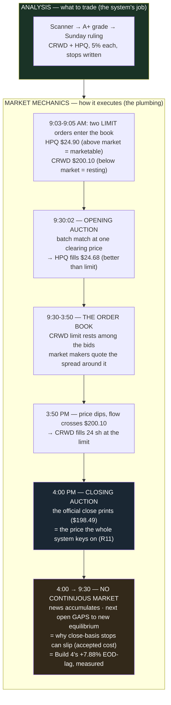

# Explainer — Market Mechanics (the plumbing, taught by the Jul 20 fills)

**Genre:** concept explainer · **Illuminates:** R11's close-basis rationale, the MOC execution choice, D-009's EOD-lag question

## Definition

**Market mechanics is how trades actually execute and prices actually form** — as opposed to analysis, which is what to trade. Scoring, doctrine, regime: analysis. Everything between "clicked buy at 9:03" and "194 shares at $24.68": mechanics.

## The components, each grounded in a real fill

**The order book & order types.** Every stock has a standing ledger of bids and asks; the gap is the spread. A **limit order** rests until price comes to it — the CRWD $200.10 limit sat 6.5 hours until a 3:50 PM dip touched it. A **market order** takes the book's price instantly. The morning's A-or-B choice was pure mechanics: pay now, or post a price and wait.

**Auctions.** The 9:30 open and 4:00 close are **batch auctions** — accumulated orders match at one clearing price. The HPQ limit of $24.90 filled at **$24.68** because auction rules fill everyone at the single equilibrium — "better than your limit" is the auction working. The **closing auction** produces *the* close: the most liquid, most meaningful print of the day — which is exactly why the whole system is close-basis (R11 keys decisions to the price of maximum agreement, not a thin 11:47 wick).

**Liquidity & market makers.** Someone is on the other side of every trade — intermediaries quoting both sides, earning the spread. Invisible in CRWD/HPQ; the reason fills slip in thin names.

**Quote plumbing.** Last trade, mark, and official close are **different numbers from different pipeline moments** — the Jul 20 "$203.51 vs $198.49" confusion was a stale intraday artifact labeling a mid-afternoon quote as the close. Knowing which number is on screen is mechanics literacy.

**Sessions & gaps.** Trading halts at 4:00; news doesn't. Price re-forms wherever the next open's auction clears — why a close-basis stop can slip past its line on a gap (the accepted, sized cost of not tape-watching). The bank rotation's **MOC orders** are a mechanics choice: surrendering price discretion to guarantee the closing-auction print. And Build 4's **+7.88% EOD-lag** is a market-mechanics *measurement* — the cost of overnight gaps between signal (the close) and execution (the next open).

## The one-line summary

**Analysis decides what and when; mechanics determines at what price and how reliably** — every dollar between the intended trade and the actual fill lives in the mechanics layer. The system respects it in three deliberate places: close-basis decisions, MOC execution, and the measured EOD-lag. A resting limit is a *conditional* entry — certainty of fill traded for price.

**Cross-refs:** docs/rules.md (R11) · the bank-rotation framework's MOC discipline (external — predates this repo) · D-009 (the 12:30-exit question the lag number motivates)
