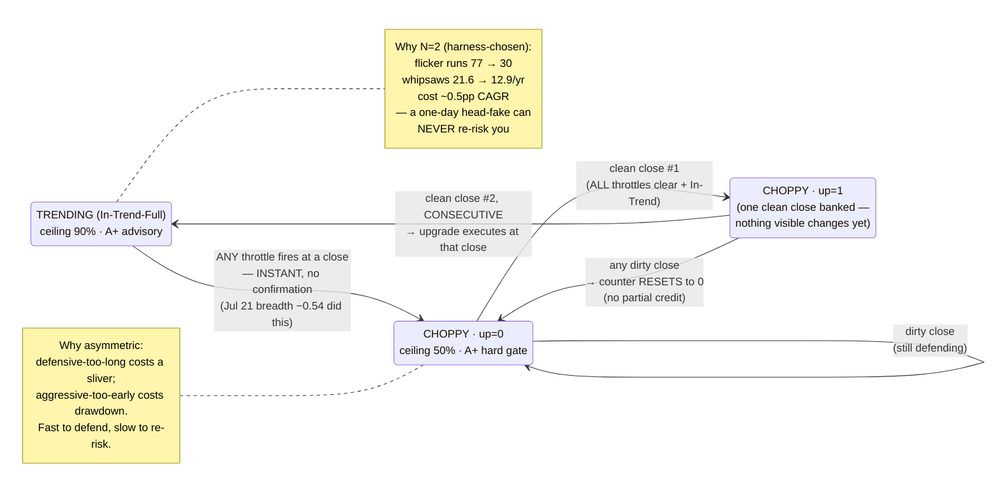

# Explainer — N=2 Asymmetric Hysteresis (the upgrade rule)

**Genre:** concept explainer · **Illuminates:** D-008 Q3, the campaign's hysteresis sweep

## The rule in one line

To climb back up the regime ladder, the all-clear must prove itself **two closes in a row**; any dirty close resets the count to zero. Downgrades need no proof at all — **fast to defend, slow to re-risk.**

## Mechanics

A **clean close** = ALL throttles clear simultaneously at that close (breadth > −0.50%, VIX 5d < 22, HY pctile < 90) AND the chassis In-Trend. Not "the one that fired recovers" — all three quiet at once.

- Clean close #1 → up-counter = **1**. Regime stays Choppy; nothing visible changes (panel shows `up=1`).
- Clean close #2, **consecutive** → the upgrade executes *at that close* — Choppy → Trending, ceiling 90%, hard gate lifts to advisory.
- Any dirty close → counter resets to **0**. No partial credit across interruptions.
- All evaluation is **close-basis** — the daily semantic the backtest validated; intraday wobbles count for neither direction.

## Why exactly 2 — chosen by the harness, not taste

Build 4's motivating disease: **11 of the old gauge's 17 Trending runs lasted ≤2 days** — Trending was a flicker state. The campaign swept N ∈ {1,2,3,5}:

| N | Effect |
|---|---|
| 1 | Too much flicker survives |
| **2** | **Flicker runs ≤2d: 77 → 30 · whipsaws 21.6 → 12.9/yr · cost ~0.5pp validate CAGR** |
| 3, 5 | Marginal extra smoothness, more return drag (late re-entry) — the sweep's 77→10 / 4.9-per-yr endpoint sits at N=5, paid for in late re-entry |

By construction, **a one-day head-fake can never re-risk you.**

## Why asymmetric at all

The error costs aren't symmetric: staying defensive one close too long costs a sliver of upside; going aggressive one close too early into a real breakdown costs **drawdown** — the quantity the Quality calibration exists to minimize. So the design exits risk instantly on one signal and re-enters only after calm proves itself twice.

## Live proof, both directions

- **Upgrade cycle (first ever):** Jul 16 chassis state read In-Trend-Throttled `up=1`; Jul 17's clean close was the consecutive second → Trending confirmed, on cutover day.
- **Downgrade (first live fire):** Jul 21, breadth −0.54% → instant Choppy at the close. Earliest possible return: two clean closes later.

**Cross-refs:** D-008 record (Q3 ruling) · docs/gauge-b-campaign.md (the N sweep) · docs/explainers/regime-first-throttle-fire-2026-07-21.md (the downgrade this rule now governs the recovery from)
