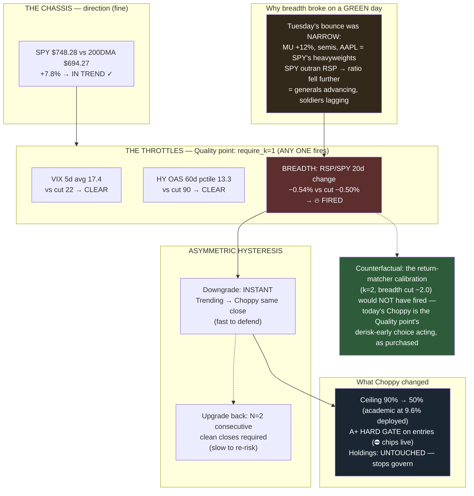

# Explainer — The First Live Throttle Fire (2026-07-21)

**Genre:** event explainer · **Illuminates:** D-008 (Gauge B), the Quality calibration
**Event:** Regime Trending → Choppy at the July 21 close — the chassis's first live defensive call, four days after cutover.

## The one-sentence cause

The breadth throttle fired: the RSP/SPY 20-day ratio change closed at **−0.54%**, four basis points through the **−0.50%** cut locked in the Quality calibration — and under `require_k=1`, one throttle firing downgrades **instantly** (asymmetric hysteresis, fast to defend).

## What the breadth measure is

RSP is the equal-weight S&P 500; SPY is cap-weighted. The gauge tracks their **ratio, changed over 20 sessions** — a participation meter. Falling ratio = the index is being carried by a few heavyweights while the average stock lags = **narrow leadership**, historically the fragile kind of advance.

## The two-week path to the line

| Date | Breadth 20d | Tape |
|---|---|---|
| Jul 14 | −0.36% | Rotation churning, tech softening |
| Jul 15 | risk_off flip | Breadth breakdown (old gauge printed Caution) |
| Jul 17 | **+0.57%** | Rotation *into* financials/energy → Trending 3/0/0 |
| Jul 20 | +0.18 | Red day, narrow |
| **Jul 21** | **−0.54%** | **Throttle fires → Choppy** |

## The subtlety: it fired on a GREEN day

Tuesday's bounce was narrow — MU +12%, semis, AAPL: SPY's heavyweights. A mega-cap-led rally makes SPY outrun RSP, pushing the ratio **down** — the rally itself worsened breadth. The gauge is deliberately blind to index direction; it watches *who carries it*. Generals advancing without soldiers is the condition Choppy names.

## Why only breadth

VIX 5d 17.4 vs cut 22 — clear. HY OAS at the **13th percentile** vs cut 90 (validated FRED basis) — clear. A *participation* warning, not a stress warning: the mildest of the three possible fires.

## The counterfactual that prices the calibration choice

The other finalist that Sunday (return-matcher: `k=2, breadth cut −2.0`) **would not have fired** — one throttle isn't enough under k=2, and −0.54 is nowhere near −2.0. Under that calibration the regime would still read Trending. Today's Choppy is the Quality point's derisk-early choice acting, exactly as purchased (the −11.4% max-drawdown profile bought with early flinches).

## What Choppy changed — and didn't

Ceiling 90% → 50% (academic at ~10% deployed) · **A+ hard gate on entries** (⛔ grade-blocked chips live in Slack) · **holdings untouched** — stops govern positions, always.

**Cross-refs:** D-008 record (architecture + Quality amendment) · docs/explainers/n2-asymmetric-hysteresis.md (the path back) · docs/gauge-b-throttle-sweep.md (the frontier the calibration came from)
