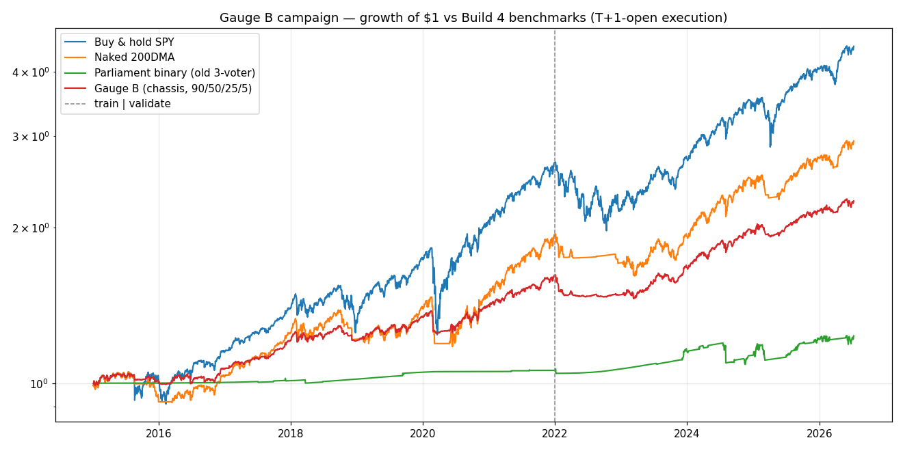
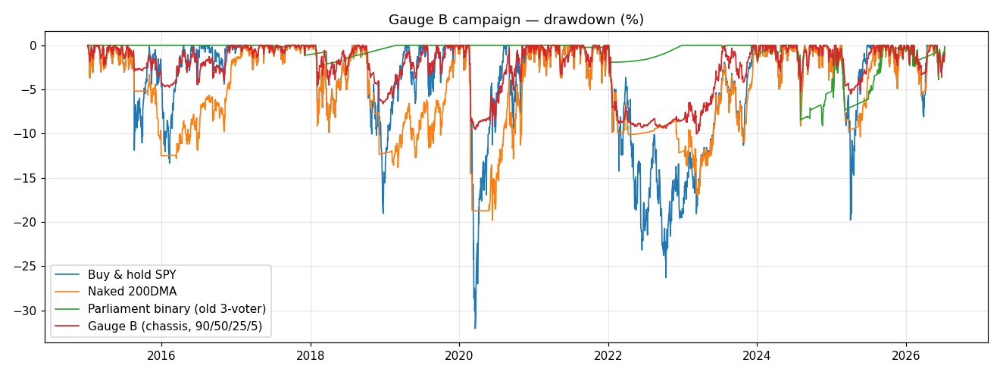
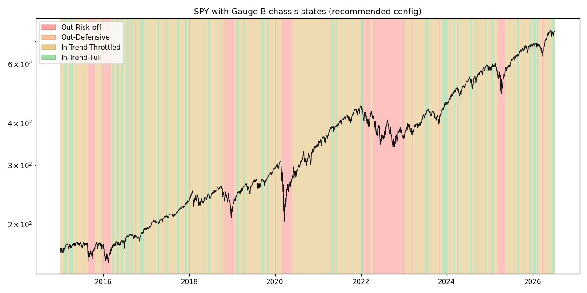

# Gauge B — parameter-selection campaign (D-008)

**Analysis only.** This extends the [Build 4 harness](backtest-regime.md) with the
candidate **trend-chassis** gauge and runs the three [D-008](decisions/D-008-gauge-b-architecture.md)
sweeps on the [D-006](decisions/D-006-build4-protocol.md) protocol — train
**2015-2021**, validate **2022-2026**, both windows always reported, no post-hoc
tuning presented as validation. It touches **no production code path** and changes
**no live gauge**: `regime_calculator.compute_regime` (the parliament) is imported
unchanged as a control only. This campaign picks Gauge B's parameters for the user
to adjudicate; it is not a build.

Harness: [`scripts/backtest_gauge_b.py`](../scripts/backtest_gauge_b.py) ·
full metric set (every window × CAGR/Sharpe/Sortino/maxDD/exposure) in
[`gauge-b-campaign-results.json`](gauge-b-campaign-results.json) ·
pins: [`test_backtest_gauge_b.py`](../test_backtest_gauge_b.py).

## The candidate chassis (STEP 0)

`compute_regime_chassis(trend_state, vix_5d, hy_measure, breadth_20d,
hysteresis_state) → {state, exposure}`, implementing D-008:

- **Q1 — the 200DMA trend is the chassis.** In-trend (SPY ≥ 200DMA) vs out-of-trend
  decides *direction*; VIX, HY credit, and breadth are **throttle modifiers** that
  scale exposure *within* the trend and never override it. Four states, mapped to
  the Q4 rungs:

  | State | When | Ceiling (90/50/25/5) |
  |---|---|---|
  | **In-Trend-Full** | SPY ≥ 200DMA, no throttle active | 90% |
  | **In-Trend-Throttled** | SPY ≥ 200DMA, ≥1 throttle active | 50% |
  | **Out-Defensive** | SPY < 200DMA, no stress trigger | 25% |
  | **Out-Risk-off** | SPY < 200DMA, elevated vol OR credit stress | 5% |

- **Q3 — asymmetric hysteresis.** Downgrades are instant (the crash brake); upgrades
  require **N consecutive closes** above the confirmed level (slow to re-risk).
  Symmetric (both directions require N) runs as the control.
- **Q4 — regime → R28 ceiling 90/50/25/5** (ruled), swept vs the drafted 25/15/5/0
  and binary(chassis).

**Throttle calibration (fixed across every sweep, documented for honesty):** VIX 5d
avg ≥ 20 (elevated vol); breadth_20d < 0 (RSP lagging SPY); HY stress per the Q2
shape. These thresholds are **held constant** — the sweeps vary only the Q2 shape,
Q3 N, and Q4 ladder. A throttle-threshold sweep is a possible follow-up and is
called out in the verdict, because the ladder's return cost is calibration-sensitive.

## Lookahead discipline

Inherited from `build_inputs` (every window trails T; OAS lags one FRED-publication
day) and preserved: the HY shapes use trailing rolling windows only — pre-warmed on
the full OAS history so the long 252/504d windows aren't unfairly truncated at the
2015 start — and the hysteresis replay is strictly causal. The stateful chassis gets
its own pin the parliament didn't need — **replaying on data truncated at T
reproduces the full-series confirmed state at T exactly** (this is the causality
proof). All green ([`test_backtest_gauge_b.py`](../test_backtest_gauge_b.py)):
chassis logic, both hysteresis modes, a shift *sensitivity* check (7.2% of states
flip on a +1d lag — the gauge is time-live), and the walk-window truncation match
(25 sampled dates, incl. the stateful hysteresis).

## Benchmarks (the bar)

Recomputed by this harness — they reproduce Build 4 exactly, confirming machinery
consistency. **The bar (Build 4's own standard): beat the naked 200DMA, or the
redesign hasn't earned itself.**

| Strategy | Train CAGR | Val CAGR | Full CAGR | Full Sharpe | Full Sortino | Full maxDD | Days-inv |
|---|---|---|---|---|---|---|---|
| Buy & hold SPY | 14.95% | 12.15% | **13.93%** | 0.74 | 1.01 | −32.05% | 100% |
| Naked 200DMA | 9.81% | 9.65% | **9.83%** | 0.68 | 0.92 | −19.82% | 82.6% |
| Parliament binary (old 3-voter) | 0.82% | 3.33% | **1.85%** | −0.03 | −0.03 | −9.09% | 8.9% |

## Sweep Q2 — credit-measure bakeoff

Each HY shape through the chassis at N=2 asymmetric, 90/50/25/5. Headline question:
does it stay invested through the 2015-2023 normal bull (which absolute-OAS sat out
entirely) **and** defend in real credit stress — on **both** windows? (Full
Sortino/maxDD for every row are in the results JSON.)

| HY shape | Stress-days | Bull avg-exp | COVID avg-exp | 2022 avg-exp | Train CAGR/Sh | **Val CAGR/Sh** |
|---|---|---|---|---|---|---|
| **pctile_60d** | 23.1% | 47.0% | 11.1% | 15.6% | 7.01 / 0.92 | **7.58 / 0.54** |
| pctile_252d | 20.8% | 47.0% | 11.9% | 15.6% | 6.38 / 0.82 | 6.22 / 0.33 |
| pctile_504d | 17.7% | 47.3% | 11.9% | 15.6% | 5.95 / 0.75 | 6.26 / 0.34 |
| zscore_252d | 18.6% | 47.1% | 11.9% | 15.6% | 6.36 / 0.82 | 6.28 / 0.34 |
| zscore_504d | 15.3% | 47.5% | 11.9% | 15.6% | 6.00 / 0.76 | 6.26 / 0.34 |
| direction_20d | 41.9% | 45.4% | 10.3% | 15.6% | 6.51 / 0.88 | 6.31 / 0.37 |

**Every shape is regime-adaptive** — ~47% avg exposure through the normal bull but
~11–16% through COVID and the 2022 bear. This is the fix for absolute-OAS's fatal
flaw (it sat uninvested nine years). **pctile_60d wins**: selected on **train**
Sharpe (0.92, the highest — D-006: choose in-sample), it **also tops the validate
window** (Sharpe 0.54 vs the others' 0.33–0.37), so the pick is neither a train
overfit nor a validate mine. It's the most reactive of the percentile/z family
(23.1% stress-days; `direction_20d` fires more often, 41.9%, but on a cruder
sign-of-change signal and scores no better). The longer-window percentile/z shapes
are nearly indistinguishable from one another and duller.

## Sweep Q3 — hysteresis N (best shape: pctile_60d, 90/50/25/5)

Does asymmetric N fix the Trending flicker (Build 4: 11/17 Trending runs ≤2 days)?

| Variant | In-Trend-Full runs (≤2d) | Median run | Whipsaws/yr (val) | Train CAGR/Sh | Val CAGR/Sh |
|---|---|---|---|---|---|
| asym **N=1** (≡ no hysteresis) | 134 (77) | 2d | 21.6 | 7.45 / 0.94 | 8.08 / 0.58 |
| asym **N=2** | 80 (30) | 4.5d | 12.9 | 7.01 / 0.92 | 7.58 / 0.54 |
| asym **N=3** | 58 (15) | 5d | 7.8 | 6.73 / 0.91 | 6.93 / 0.46 |
| asym **N=5** | 43 (10) | 6d | 4.9 | 6.83 / 0.95 | 6.48 / 0.41 |
| sym N=2 (control) | 68 (14) | 7d | 10.2 | 6.83 / 0.85 | 6.94 / 0.43 |
| sym N=3 (control) | 49 (0) | 11d | 3.8 | 7.29 / 0.90 | 6.53 / 0.37 |
| sym N=5 (control) | 33 (0) | 14d | 0.7 | 6.87 / 0.83 | 5.89 / 0.28 |

**Asymmetric N works and beats symmetric at equal N** (higher validate CAGR/Sharpe —
the fast crash-brake is worth keeping while only the upgrades are damped, exactly the
D-008 rationale). Higher N monotonically kills the flicker (median run 2→6d, runs≤2d
77→10, whipsaws 21.6→4.9/yr) at a gentle CAGR cost. **N=1 is no hysteresis** — it
posts the highest validate CAGR/Sharpe (8.08% / 0.58) but flickers hardest (77 of
134 In-Trend-Full runs ≤2d, 21.6 whipsaws/yr), the exact defect Q3 exists to fix.
**N=2 is the sweet spot**: it roughly halves the flicker (77→30 short runs, whipsaws
to 12.9/yr) for ~0.5pp of validate CAGR; **N=3** damps further (whipsaws 7.8/yr) at
~0.65pp more. The choice here is flicker-vs-CAGR — not a Sharpe win over N=1.

## Sweep Q4 — exposure ladder (pctile_60d, asym N=2)

Same chassis states, three ceilings:

| Ladder | Train CAGR | Val CAGR | Full CAGR | Full Sharpe | Full Sortino | Full maxDD | Whip/yr |
|---|---|---|---|---|---|---|---|
| **90/50/25/5** (ruled) | 7.01% | 7.58% | 7.31% | 0.78 | 1.05 | −10.03% | 10.1 |
| 25/15/5/0 (drafted) | 2.56% | 4.97% | 3.52% | 0.75 | 1.01 | −2.81% | 10.1 |
| binary(chassis) | 10.82% | 8.86% | **10.13%** | 0.71 | 0.97 | −17.18% | 1.8 |

The ruled **90/50/25/5** dominates the drafted **25/15/5/0** decisively (7.31% vs
3.52% full CAGR at similar Sharpe) — the amendment was right; the old draft
under-invested. **binary(chassis)** — pure direction + hysteresis, no throttle
ladder — posts the highest CAGR (10.13% full, beating the 200DMA's 9.83%) with the
fewest whipsaws (1.8/yr), but the deepest drawdown (−17.18%). The throttle ladder is
what converts return into drawdown protection.

## Recommended config per question

| Question | Recommendation | Rationale |
|---|---|---|
| **Q1 chassis** | 4-state trend chassis as defined | Fixes the parliament's fatal flaw — stays invested in bulls (~47% vs the parliament's ~9%), defends in real stress |
| **Q2 credit shape** | **pctile_60d** | Top train Sharpe (0.92) *and* top validate Sharpe (0.54); most reactive of the percentile/z family; the longer-window shapes are duller and near-identical |
| **Q3 hysteresis** | **asymmetric N=2** (N=3 if flicker matters more) | Asymmetric beats symmetric at equal N; N=2 roughly halves the flicker (77→30 short runs, 21.6→12.9 whip/yr) for ~0.5pp validate CAGR. N=1 scores higher but *is* the flicker Q3 fixes |
| **Q4 ladder** | **90/50/25/5** (ruled) | Dominates 25/15/5/0; the binary row shows the throttle ladder trades CAGR for drawdown — a deliberate choice, see verdict |

## Charts







## Verdict — does Gauge B beat the naked 200DMA?

**On CAGR: no. On risk-adjusted terms: yes. Read honestly, it's a drawdown-reducer,
not a return-enhancer — and that is the choice on the table.**

- **The recommended config (pctile_60d, asym N=2, 90/50/25/5) does NOT clear Build 4's
  bar.** Full CAGR **7.31% vs the 200DMA's 9.83%**; validate **7.58% vs 9.65%**. By the
  strict CAGR-vs-200DMA bar, it falls short — stated plainly, same protocol as Build 4.
- **But it wins on the terms a swing trader arguably cares about more:** full Sharpe
  **0.78 vs 0.68**, Sortino **1.05 vs 0.92** (it even edges buy-and-hold's 1.01), and
  maxDD **−10.03% vs −19.82%** — roughly half the drawdown, visibly smoother through
  2020 and 2022. It buys ~2.5pp of CAGR of drawdown insurance.
- **The D-008 architecture is validated on its own terms.** Gauge B massively fixes
  the parliament Build 4 humbled (1.85% → 7.31% CAGR; the "nine years uninvested"
  flaw is gone), asymmetric hysteresis demonstrably kills the flicker, and the ruled
  90/50/25/5 ladder decisively beats the drafted 25/15/5/0.
- **The return gap is throttle-calibration-sensitive, not a chassis failure.** The
  chassis *direction* alone — **binary(chassis), 10.13% full CAGR** — beats the 200DMA
  on train and full (though it falls just short on validate: 8.86% vs 9.65%). What
  costs the ~2.5pp is the throttle ladder cutting exposure to 50% whenever any one
  throttle fires (~47% avg exposure through the bull). A less aggressive throttle
  (require ≥2 throttles for Throttled, or lower VIX/HY sensitivity) would invest more
  and close the gap toward the binary — at the cost of the drawdown protection. **This
  is the real lever, and a throttle-threshold sweep is the recommended follow-up**
  before this becomes the build spec.

**Bottom line for adjudication:** the chassis + asymmetric hysteresis architecture is
sound and fixes what Build 4 broke. Whether Gauge B "earns itself" depends on the
objective: it does **not** beat the 200DMA on raw return with the 90/50/25/5 throttle
ladder as calibrated, but it delivers meaningfully lower drawdown and higher
Sharpe/Sortino, and the direction layer alone ties the 200DMA on full/train (just
short on validate). The parameter to revisit before committing is the **throttle
calibration**, not the chassis or the ladder.

## Retest recipe

```
python3 scripts/backtest_gauge_b.py          # full campaign -> results JSON + charts
python3 test_backtest_gauge_b.py             # chassis units + lookahead pins
```

## Links

- Ruling: [D-008](decisions/D-008-gauge-b-architecture.md) (Q1–Q4); protocol: [D-006](decisions/D-006-build4-protocol.md)
- Build 4 record: [docs/backtest-regime.md](backtest-regime.md) (the benchmarks + the flicker/train-collapse findings this campaign answers)
