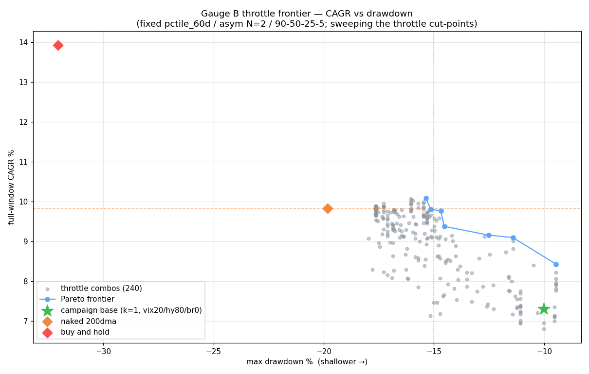

# Gauge B — throttle-calibration frontier (D-008 follow-up)

**Analysis only.** The [Gauge B campaign](gauge-b-campaign.md) validated all three
D-008 rulings (pctile_60d, asymmetric N=2, 90/50/25/5 ≫ the drafted 25/15/5/0) but
its verdict flagged one open lever: the campaign's tight throttle (any single
throttle cuts In-Trend exposure to 50%) held avg bull exposure near 47% and cost
~2.5pp of CAGR vs the naked 200DMA — while `binary(chassis)` (throttle off) posted
10.13%. **The gap is throttle calibration, not the chassis.** This sweep maps the
tradeoff so the parameter can be picked on evidence before Gauge B becomes a build
spec. Same [D-006](decisions/D-006-build4-protocol.md) protocol (train 2015-2021 /
validate 2022-2026, both reported); same [harness](../scripts/backtest_gauge_b.py)
(`--throttle-sweep`); results in
[`gauge-b-throttle-results.json`](gauge-b-throttle-results.json).

## Method

Fixed the winning config (**pctile_60d shape, asymmetric N=2, 90/50/25/5 ladder**);
swept only the **In-Trend Full→Throttled cut-points** — a 5×4×4×3 = **240-combo**
grid over VIX threshold (18/20/22/25/30), HY-percentile cutoff (70/80/90/95),
breadth cutoff (0/−0.5/−1/−2), and **`require_k`** = how many throttles must fire to
downgrade (1/2/3). Higher thresholds and higher `require_k` = looser. The chassis
throttle is now a config knob; **defaults reproduce the campaign bit-for-bit** (pin:
`test_throttle_config`, and the campaign JSON is unchanged by the refactor).

**The question:** can a looser throttle recover full-window CAGR toward the 200DMA's
**9.83%** while holding **maxDD shallower than −15%**?

## The frontier

Recomputed benchmark bar — **naked 200DMA: 9.83% CAGR / −19.82% maxDD** (validate
9.65%). Campaign base (tight, k=1 / vix20 / hy80 / br0): **7.31% / −10.03%**
(validate 7.58%).

Pareto-efficient points (full-window CAGR vs maxDD), validate reported alongside:

| Throttle config | Full CAGR | Full maxDD | Full Sharpe | Full Sortino | **Val CAGR** | Val maxDD | Full avg-exp |
|---|---|---|---|---|---|---|---|
| k3 · vix20 · hy80 · br−0.5 | **10.09%** | −15.37% | 0.78 | 1.07 | 8.55% | −15.04% | 74.0% |
| k3 · vix20 · hy95 · br0 | 9.81% | −15.15% | 0.75 | 1.03 | 8.63% | −14.82% | 74.2% |
| **k2 · vix20 · hy95 · br−2** | **9.77%** | **−14.69%** | 0.77 | 1.05 | 8.60% | −14.36% | 73.5% |
| k2 · vix18 · hy95 · br−2 | 9.38% | −14.53% | 0.74 | 1.01 | 7.74% | −14.19% | 72.6% |
| k2 · vix18 · hy95 · br−0.5 | 9.16% | −12.51% | 0.75 | 1.02 | 7.47% | −12.17% | 69.8% |
| **k1 · vix22 · hy90 · br−0.5** | 9.10% | **−11.42%** | **0.88** | **1.22** | 7.59% | −11.08% | 60.1% |
| k1 · vix20 · hy80 · br−0.5 | 8.43% | −9.46% | 0.85 | 1.17 | 7.37% | −9.10% | 57.1% |
| _campaign base_ (k1/vix20/hy80/br0) | 7.31% | −10.03% | 0.78 | 1.05 | 7.58% | −9.68% | 48.7% |

**17 of the 240 combos** clear the target zone (full CAGR ≥ 9% **and** maxDD > −15%).



The **upper** frontier reaches the 200DMA's 9.83% CAGR at ~−15% drawdown, which the
200DMA only earns at −19.82% — and one point (k3/vix20/hy80/br−0.5, **10.09% /
−15.37%**) strictly dominates it (more return *and* less drawdown). So on the full
window a calibrated Gauge B **matches-or-beats the 200DMA's return at ~5pp less
drawdown**; the lower frontier points trade CAGR down for even shallower drawdowns
(the campaign base sits at the bottom-right, 7.31% / −10.03%).

## Verdict — yes, the throttle is the lever

**Answer: yes.** Loosening the throttle recovers full-window CAGR from the base's
7.31% up to ~9.8–10.1%, and multiple points **match/beat the 200DMA's 9.83% CAGR
while holding maxDD under 15%** — decisively confirming the campaign's diagnosis that
the return gap was throttle calibration, not the chassis.

Two natural picks (the user chooses the point on the curve):

- **Return-matcher — k2 / vix20 / hy95 / br−2: 9.77% CAGR at −14.69% maxDD** (validate
  8.60%). Essentially the 200DMA's return with ~5pp less drawdown — Gauge B's original
  promise, delivered.
- **Quality point — k1 / vix22 / hy90 / br−0.5: 9.10% CAGR at −11.42% maxDD, Sharpe
  0.88 / Sortino 1.22** (the best risk-adjusted point on the frontier; only a hair off
  the 200DMA's CAGR at little more than half its drawdown).

**Honest caveat (D-006):** the frontier is a full-window Pareto curve, and validate is
softer — the loosened return-matchers reach ~**8.5–8.6% validate CAGR vs the 200DMA's
9.65%**, still ~1pp short out-of-sample, and the drawdown edge narrows too: ~5pp on
the full window but only **~1.6–2.3pp on validate** for these points (200DMA validate
maxDD −16.66% vs their −14.4 to −15.0%) — still an edge, just a smaller one. So the
full-window "dominates the 200DMA" reading is real but partly a train-window effect;
out-of-sample it's "slightly less CAGR, moderately less drawdown." A chosen point should be sanity-checked on validate, not mined for the
single best full-window number — the curve exists to expose the tradeoff, not to
hand back an over-fit optimum.

**Recommendation for the build spec:** adopt a **looser throttle than the campaign
base** — `require_k=2` with a high HY-percentile cutoff (≈90–95) is the sweet spot
that recovers the return while keeping the drawdown edge. The exact point is the
user's call from the frontier; `k2 / vix20 / hy95 / br−2` and `k1 / vix22 / hy90 /
br−0.5` bracket the return-vs-risk choice.

## Retest recipe

```
python3 scripts/backtest_gauge_b.py --throttle-sweep     # frontier -> JSON + chart
python3 test_backtest_gauge_b.py                          # incl. throttle-config pin
```

## Links

- Parent: [gauge-b-campaign.md](gauge-b-campaign.md) · ruling [D-008](decisions/D-008-gauge-b-architecture.md) · protocol [D-006](decisions/D-006-build4-protocol.md)
